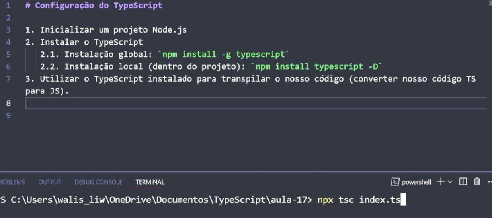
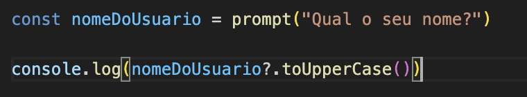

# [Typescript](https://www.typescriptlang.org/)

- Javascript com adicao de tipagem estatica, minimizando erros
    - recursos novos como interfaces e generics

- é o padrao do AngularJS
- é compilado em js
    - usa versao mais nova no ts e converte pro que está atual no navegador

## configurando e compilando o TS



- após salvar o arquivo `.ts` é importante usar o comando `npm tsc` pois ele compila pra js e atualiza o arquivo .js homonimo
    - se digitar `npm tsc --watch` ele acompanha as modificacoes feitas e salvas. É só digitar `controlC` pra sair
- se escrever `npx tsc --init` ele cria um json com todas as configuracoes do ts

## Tipagens

- number
- string
- boolean
- null


- nessa imagem, ele já tava reconhecendo que `nomeDoUsuário` tinha tipagem string (quando preenchido) ou null (quando a pessoa cancelasse)
    - quando eu peço para que ele deixe tudo em upper case, ele coloca a interrogacao para deixar claro que, se for possivel, ele fará isso

- array types
    - coloca sempre o nome da variável, dois pontos, e o simbolo de array que é []
    ```typescript
    const numeros: number[] = [1, 2, 3] //mais comum

    OU

    const numeros<number> = [1, 2, 3]
    ```
    - union types: no lugar do type, colocar ambos os tipos entre parenteses divididos por |
        - quando souber que os valores dentro do array sao sempre fixos, mesmo com dois tipos, pode usar a sintaxe:
        ```typescript
        const cadastro: [string, number] = ["nome da pessoa", 23] //onde 23 é a idade
        ```
    - **Best Practices**: fazer arrays mistos nao é uma boa pratica

- type `any` é um JS em arquivo TS 

## object types

- interface:
    - interface é um tipo customizavel, muito ligado à orientacao a objeto
    - cria um modelo do que precisa existir para aquele objeto ser do tipo que acabou de ser criado
    - se add ? apos a propriedade, ela náo é obrigatória
- type: é muito parecido à interface, mas é mais abstrato

- literal types: são tipos que sao constantes, tipo lower (que é o menor) ou greater (que é o maior)

## Utility types

