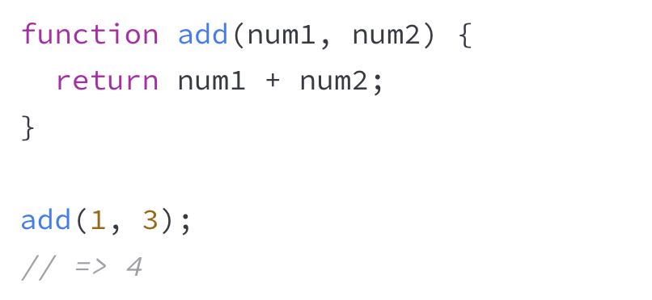

# Exercism

> até a 3a camada (arrays/conditionals/comparisons)

- On Exercism, **variables** are always written in camelCase; **constants** are written in SCREAMING_SNAKE_CASE. 
- **units of functionality** are encapsulated in functions
    - can take **parameters (arguments)**, and can return a value using the return keyword. Functions are invoked using **() syntax**
    - 
- **module system**
    - **export**: para fazer uma variável, constante ou função para ser usada em outro arquivo
    - **import**: faz o outro arquivo importar elas
    

## Exercício básico

### Instructions

Lucian's girlfriend is on her way home, and he hasn't cooked their anniversary dinner!

In this exercise, you're going to write some code to help Lucian cook an exquisite lasagna from his favorite cookbook.

You have four tasks related to the time spent cooking the lasagna.

### Resolução

Instruções de cada task e resoluções no [basic.js](./basic.js). Há também comentários meus sobre as resoluções.

