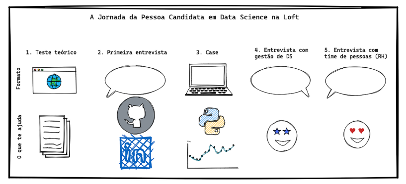

# Sprint Processos Seletivos em Tech

## Como procurar por boas vagas de trabalho

- Networking - rede pessoal
- seguir empresas que voce gostaria de trabalhar
    - as quais você acredita que conseguirá contribuir e nas quais ficará feliz em trabalhar
    - fazer contato por e-mail ou pelas seções “trabalhe conosco”
- use linkedin

## Estudar para entrevistas

- pesquise os produtos, serviços e valores da empresa
- tendências do mercado tech
- descrição da vaga:
    - exemplos e experiências que se encaixem
- Pense em respostas para as seguintes perguntas:
    - Qual sua pretensão salarial?
    - O que te chamou atenção em nossa empresa e nessa oportunidade de emprego?
    - Quais seus objetivos profissionais?
    - Onde você se imagina daqui a cinco anos?
    - O que te motiva e desmotiva em uma empresa/time?
    - Qual foi sua maior contribuição no último projeto que atuou?

### Case interview e testes técnicos

- Muita atenção aos requisitos técnicos exigidos:
    - estude sobre eles
    - rever conceitos
    - sem medo de mostrar que não sabe, mas que pesquisou sobre e buscou entender
- tire duvidas
- Construa uma linha lógica de raciocínio para o que está sendo pedido
    - não enfeitar demais
- mostre vontade, empenho, mesmo com erros
- abertura para troca de opiniões e para opiniões divergentes

- **Coding Skills (algoritmo)**
    -  **objetivo**: avaliar a habilidade da pessoa candidata em transformar um requisito de negócio em código
    - não há um gabarito ou uma unica forma de resolver
    - importante se comunicar bem, a entrevistadora está ali pra te ajudar a resolver
    - agir como se fosse um pair programming é uma boa ideia
    - **pontos focais**: estrutura de dados, lógica de programação, legibilidade de código
    - **materiais bons**:
        - Cracking the Coding Interview (Gayle Laakmann McDowell) 
        - Clean Code (Robert C. Martin)
- **Code Design (organização de código)**
    - **objetivo**: avaliar a habilidade da pessoa candidata em desenvolver um software testável e de fácil manutenção
    - não é um teste de escrever código e sim um desenho sobre o software e suas soluções
    - não há apenas uma maneira certa de resolver o problema
    - precisa de boa comunicação
    - **pontos focais**: organização de código e testes automatizados
        - design patterns, SOLID
    - **materiais bons**: 
        - https://refactoring.guru/design-patterns
        - Orientação a Objetos e SOLID para Ninjas (Mauricio Aniche) - *mais básico*
        - Princípios, Padrões e Práticas Ágeis (Robert C. Martin) - *para aprofundar*
        - Test-Driven Development (Mauricio Aniche) 

- **Arquitetura front-end ou back-end**
    - desenho de uma solução de arquitetura de sistemas, na qual os componentes podem ser aplicações, banco de dados além de outras tecnologias e ferramentas
        - desenhar caixinhas de como poderia ser feita a separação de cada pedacinho do código de acordo com os cenários que o entrevistador te passar
    - **objetivo**: como você usa as diversas ferramentas para solucionar problema
    - ter habilidade insvestigativa para encontrar solução de negócio e solução técnica
    - pode perguntar, se comunicar e falar o que está pensando
    - **pontos focais**: Arquitetura monolítica e arquitetura em microsserviços, Comunicação entre sistemas distribuídos
    - **materiais bons**: Building Evolutionary Architectures (Neal Ford, Rebecca Parsons, Patrick Kua)

### Para Data Science

- **teste teórico**
    - conhecimentos de estatística e Machine Learning
    - **objetivo**: pessoas que dão um passo além do “import regressão from sklearn“, que entendam o que está acontecendo no algoritmo e que conheçam os principais erros do pipeline de Machine Learning
    - **materiais importantes**: Hands-On Machine Learning with Scikit-Learn, Keras, and Tensorflow, Pattern Recognition and Machine Learning, Statistical Learning (Abu Mostafa), Machine learning, Coursera
- **Case**
    - machine learning “raíz” -  ver a extensão da habilidade de ML da pessoa e outras habilidades paralelas a isso, como, por exemplo, feature engineering e coleta de informações externas
    - machine learning com pegada mais forte em negócios
    - saiba o que está acontecendo por trás do código
    - **pontos focais**: ligar ML com a “vida real”

