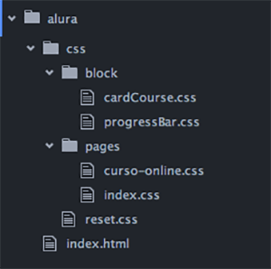
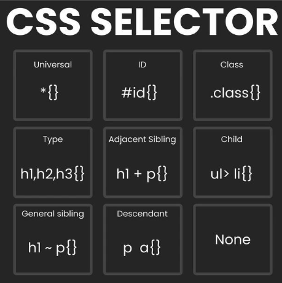
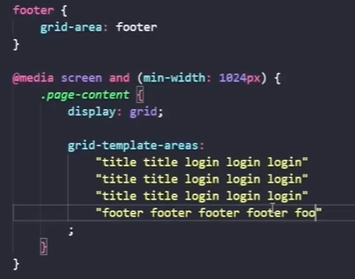

# CSS

- Dá estilos ao HTML.
- “Cascading Style Sheet”
- Composto por **declarations** (declarações):
  - pedaços de código que se referem e aplicam alterações a uma parte do HTML
  - Como escrever?
  - seletor (usa uma tag, por exemplo body). ex:

    ```css
    Seletor/tag {
    propriedade: valor;
    }
    ```

  - sempre termina uma instrução com ponto e vírgula;
  - sempre coloca chaves após o seletor e ao final da declaração
  - se colocar a instrução com /* no início e */ no final, ela será ignorada, ficará como comentário

- quando o browser vai avaliar o css, ele lê da direita pra esquerda, então primeiro ele pega a info sobre o estilo depois ele segue para ver os seletores na ordem de `p`, depois uma `div` que tem `id#content` até `body` (no exemplo abaixo):
  ```css
    body div#content p {
      color: #003366;
    } 
  ```

- Quando há mais de uma informação, a ultima é mais relevante. Por exemplo, se houver duas informações sobre cor, a ultima será mais relevante.

## Arquitetura de Css

- existem alguns modelos

### OOCSS

- decoupling by dropping descendent selectors in favor of classes

### BEM - Block, Element, Modifier

- separation of structure and presentation
  - decoupling - tentar desconectar mais o html do css, não deixando eles tão fortemente presos um ao outro
  - be able to completely rewrite our html or css without touching the other
> criamos uma pasta css, dentro dela criamos outra pasta com o nome de block. Todos os seletores dos blocos cardCourse e progressBar, ficam dentro de um arquivo com o nome de cardCourse.css e progressBar.css, que fica salvo dentro da pasta block. E qualquer arquivo CSS que não for um bloco fica na raiz da pasta css, como o famoso arquivo reset.css. Quando temos um CSS que vai ser utilizado apenas em uma página, colocamos ele dentro da pasta page.


- blocks e elements
  - formam unidades funcionais
  - devem ter keywords
    - só são reusados se o mesmo bloco é reutilizado
    - são as classes
    - quando precisar de um elemento muito parecido, apenas com uma diferença pequena, usarum modificador no nome da classe
    - guidelines:
      - Blocks should have unique names, which become classes
      - HTML elements should not be used in css selectors since they aren’t context-free
      - Cascading selectors for several blocks should be avoided
- Blocks
  - são entidades independentes
  - podem conter outros blocos
  - simples ou complexos
  - exemplos: header, footer são blocos que conteém muitos outros blocos
- Elements
  - partes dos blocos
  - tem funções dentro dos blocos
  - context dependent
  - exemplo: um bloco para pesquisa deve ter pelo menos 2 elementos, input e botão

### DRY - don’t repeat yourself

- to think in terms of style patterns
  - reduce the need for classes in 
  - não pensar em temros de objetos html individuais
- Group reusable css properties together
  - defined by shared properties
  - várias classes que usam aquela propriedade, ao invés de repetir as mesmas informações cada vez que colocam a classe no css
- Name these groups logically
  - de acordo com o que elas representam no html
- Add your selectors to the various css groups
  - you add all the selectors that need to be displayed with the property/values of the group
  ```css
  #LIGHT-WHITE-BACKGROUND,
  .translation,
  .entry .wp-caption,
  #full-article .entry img,
  .recent-comment .comment-text,
  .roundup h3,
  .post-header-sharing,
  #post-categories td.label,
  #post-archive roundup h3,
  .subscription-manager ol,
  .light-white-background
  {
  background-color: #fff;
  border-color: #ccc;
  }
  ```

### [SMACSS - Scalable and Modular Architecture for CSS](https://smacss.com/)

- foi desenvolvido por um cara que trabalhou muito tempo com desenvolvimento de sites
- Características principais de formatação:
  - Properties are grouped by type.
    - Box - afeta o flow de todo o resto do documento/parte do documento
    - Border
    - Background
    - Text
    - Other
  - Opening bracket on the same line as the rule set.
  - Colour declarations use the short form.
- Use child selectors
- categorias dos seletores
  - Base - seletores gerais, como `body, form, html`
  - Layout - são seletores que dividem a página em partes, como `div, aside`
  - Module - são as partes modulares, reutilizáveis, como `lista de produtos, seções sidebar`
  - State - diz como os layouts e modules vão se comportar, por exemplo, em telas maiores e menores, como `hover, inactive`
  - Theme - mais detalhes ao state, nem sempre é necessário

## Especificidade

- tem prioridade sobre a cascata
- cada seletor tem um peso
- é possível colocar um id em um elemento da página, por exemplo:

```css
<p id=”primeiro”> algo</p>
<p>outro</p>
```

- colocando um id, é possível colocar características específicas naquele elemento, mesmo que ele tenha a mesma tag que outros
- no CSS, nem é preciso colocar a tag, apenas o id:

```css
p#obs {
color: rgb(110, 10, 10)
}
```

OU

```css
  #obs {
  color: rgb(110, 10, 10)
  }
```

  - OBS: porém, se voce utilizar uma vez apenas o id (segunda opção) e na outra com a tag (primeira opção), ele vai considerar a que é mais específica (com a tag) para aplicar
- força desses elementos:
  - id = 1,0,0
  - class = 0,1,0
  - normais = 0,0,1

## Box model

- tudo é visto como caixas
- possuem propriedades específicas:
  - largura
  - altura
  - conteúdo
  - borda
  - espaço interno
  - espaço externo


- mais ou menos: cada tag é uma caixa
```css
body {
  background: rgb(172, 113, 172);
  border: 5px solid burlywood;
}
p {
  border: 1px solid white;
  color: white
}
#obs {
  color: rgb(153, 12, 12);
}
.dicas {
  color:greenyellow;
}
```


- o display tradicional é block, porém podemos colocar display inline, por exemplo, e ele colocar uma caixa ao lado da outra.
  - span, a e img são tags que tem display automaticamente inline
- Quando criamos uma caixa, ela pode ter várias caixas dentro dela
  - podemos especificar tamanho (height e width)
    - height não é  colocado na maior parte das vezes, pois a caixa vai aumentando a altura de acordo com os elementos internos dela
  - podemos colocar valor das margens, ou seja, espaço entre a borda da caixa e a borda total da tela
    - se usarmos margin: auto ela vai colocar o mesmo valor nas laterais esquerda e direita, porém não vai alterar as top e bottom
    - elementos inline não aceitam a formatação margin: auto, por isso podemos:
      1. mudar o display para block, ao inves de inline
      2. colocar uma configuração no “pai” dele de text-align: center, aí todo o texto naquela caixa pai estará seguindo essa regra

- os id e classes não podem começar com números
  - nem com caracteres especiais (apenas _)
 
- link interessante: [CSS Tricks](https://css-tricks.com/)



## Detalhes de estilização

### Background

- **size**: ajusta o tamanho, e se eu colocar cover, ele ocupa todo o espaço que está indicado naquele container
  - precisa ter `widht` e `height` indicados
- **attachment**: muda a relação entre a imagem e o scroll da página
  - se colocar `fixed`, por exemplo, ela fica fixa e parece que o texto está passando por cima da imagem

### Text

- **transform**: deixa tudo `uppercase`, `lowercase`, `capitalize` (first letter)
- **ident**: coloca recuo de primeira linha
- `cursor: pointer` faz o mouse virar aquela mãozinha sinalizando que pode clicar

### Visibilidade

- `display:none` - some o elemento da página, inclusive o local que ele ocupava não se mantém
- `visibility: hidden` - some o elemento, mas o espaço que ele ocupava na tela se mantém
- `opacity: 0` faz com que ele fique transparente, mas todas as habilidades dele, por exemplo se for um link o botão, se mantenham e seu espaço na página também
- `transform` muda a forma do elemento, por exemplo girando (`rotate xdeg`), mudando para baixo ou para cima (`translateY: xrem`)
  - fundamental para fazer animações
  - usar `transition` no elemento normal para que ele faça transições suaves nessas animações

### Tamanhos
- px é uma unidade fixa, ela não altera conforme o navegador altera etc
- se colocar o tamanho do texto em porcentagem, ele vai se basear o percentual no tamanho classico que o navegador usa (costuma ser 16px)
- se usar a unidade `rem`, ela é o valor em pixel/10
  - então se eu estiver usando 40px, seria 4.0rem; 92px seria 9.2rem
  - rem é uma unidade flexivel, que se adapta às questões de acessibilidade do usuário
- as unidades `vw` (pra widht) e `vh` (para height) pegam o tamanho inteiro da janela, mas isso pode fazer extrapolar o tamanho do container
  - usando `rem` ele respeita o tamanho do container pai

### Posições

- o padrão é `position:static` e ai não pode alterar os lados
- `position:absolute;` faz o elemento ficar por cima de tudo, pois ele sai do conjunto de elementos da página
  - pode ficar em cima de texto, de imagem etc
  - pode colocar a posição dele usando `top` `right` `bottom` `left`
- se usar `position:fixed` ele fica fixo na tela, mesmo que voce mexa ela pra cima e pra baixo, ele se mantem ali aparecendo
- `z-index` ???
- `position:sticky` faz com que o elemento fique aparecendo na tela quanto o box dele está sendo scrollado
  - precisa ter uma definição de `top`
- `float` não se usa mais hoje em dia

### Ícones fa

- atributo `fa` dentro da tag `<i>` ou na tag `<span>` faz aparecer simbolos referentes a basic icons
  ```html
  <i class="fa fa-car"></i>
  ```
- podem ser usados também em listas
  ```html
  <ul class="fa-ul">
    <li><i class="fa-li fa fa-check-square"></i>List icons</li>
  </ul>
  ```
- `fa-spin` dentro da classe faz qualquer elemento rodar
  ```html
  <i class="fa fa-spinner fa-spin"></i>
  ```
- outras:
  - `fa-flip`
  - `fa-rotate`
  - `fa-stack` class on the parent, the `fa-stack-1x` class for the regularly sized icon, and `fa-stack-2x` for the larger icon - faz um ficar dentro do outro
- [ver mais ícones aqui](https://www.w3schools.com/icons/fontawesome_icons_intro.asp)

## Pseudo-elements

- são elementos para estilizar apenas uma parte do código, por exemplo a primeira letra da palavra/frase
- podem ser aplicados a classes específicas
- podem ter vários pseudo-elements ao mesmo tempo
- sintaxe:
  ```css
  seletor::pseudo-element {
    propriedade: valor;
  }
  ```

- é usado o ::
- o : sozinho é pseudo-class
- [Lista completa de pseudo-elements](https://www.w3schools.com/cssref/css_ref_pseudo_elements.php)

### Principais pseudo-elements

`::first-line`
- primeira linha
- pode mudar:
  - font properties
  - color properties
  - background properties
  - word-spacing
  - letter-spacing
  - text-decoration
  - vertical-align
  - text-transform
  - line-height
  - clear

`::first-letter`
- apenas em block level
- se aplica:
  - font properties
  - color properties
  - background properties
  - margin properties
  - padding properties
  - border properties
  - text-decoration
  - vertical-align (only if "float" is "none")
  - text-transform
  - line-height
  - float
  - clear
 
`::before`
- insere algo antes do conteúdo/elemento indicado

`::after`
- insere algo depois do conteúdo/elemento indicado

`::marker`
- altera os marcadores de uma lista

## Pseudo-class

- `:visited` funciona em um link, e muda a cor dele quando ele ja foi clicado
- `:hover` é o que ocorre quando passa o mouse em cima daquele elemento
  - precisa vir depois do `a {}` normal e depois do `a:visited{}` se não ele sobrescreve
- `:first-child` é apenas a primeira vez que aquele elemento aparece
  - `:nth-child ()` se refere a qualquer elemento (n) começando no zero
    - se dentro dos () colocar `(n + 1)`, quer dizer que é 0+1 que é = 1
    - se colocar `(n + 2)` quer diquei que inicia no 2º elemento
    - numa tabela, se quiser alternado, é só colocar um multiplicador no n, ficando, por exemplo, `(2n + 2)`


## Listas

- `list-style-type` é uma propriedade que altera o tipo de marcador, círculo, quadrado, numeros romanos etc
- `list-style-image` tranforma o marcador em uma imagem
- `list-style-position` diz se os marcadores estarão dentro ou fora da lista
  - pode ser outside ou inside
- se quiser usar todos na mesma linha, a ordem é: type position image

## at-rules

- são representadas por um arroba @
- exitem dois tipos, statments and blocks
- [lista de at-rules](https://www.w3schools.com/cssref/css_ref_atrules.php)
- instruem o CSS como agir
- Statements:
  - syntax
    ```css
      @identifier (RULE);
    ```
- block:
  - possui nela um conjunto de regras
  - podem se referir a animações, mudanças em cores (light e darkmode), 
  - syntax
    ```css
      @identifier (RULE) {
      }
    ```

### Animações

- `@keyframes` é usada para que a gente possa criar ações de que o elemento fará na tela
  - é só colcoar `@keyframes nome {}`, onde `nome` é o nome da animação que voce vai referenciar la no elemento
  - dentro dela, colocar
  ```css
  @keyframe nome {
    momentoX {
      o que acontece no início
    }
    momentoY {
      o que acontece no final
    }
  }
  ```
  - e aí no proprio elemento colocar `animation: nome`
  - um exemplo de pulsar
  ```css
  @keyframe pulse {
    0% {
      transform: scale(1);
      opacity: 1;
    }
    100% {
      transform: scale(1.5);
      opacity: .6;
    }
  }
  ```
  - referenciada no elemento:
  ```css
  animation: pulse 2s infinite
  ```
  - se usar `animation-direction:alternate` ele vai fazer o indicado no @keyframes dessa animação tanto na ida quando na volta dela

## Flexbox e Grid

- ajudam com a criação de designs responsivos
- trazem flexibilidade
- é possível combinar os dois:
  - fazer uma página com um perfil de um lado e um conjunto de posts do outro
  - 
- The CSS Grid Layout should be used for two-dimensional layout, with rows AND columns.
- The CSS Flexbox Layout should be used for one-dimensional layout, with rows OR columns.

### Flexbox

- alinhamento e distribuição flexiveis
  - libera, dentro do css, "novas" regras que só funcionam se for flexbox
- dentro de um container
- organiza em colunas ou linhas
  - `flex-direction`: row ou column
  - `flex-wrap`: quebra a linha para que a quantidade de filhos flex exacerbar o layout da página
  - se você colocar, em um filho flex, `flex: 1` ou outro número, significa que a distância entre os elementos dele será 1 (sem unidade mesmo), e igual pra todos
    - se em um voce colocar 2 e deixar 1 nos outros, você tera um elemento ocupando o dobro do espaço.
  - [`align-itens`](https://developer.mozilla.org/pt-BR/docs/Web/CSS/align-items) mexe no eixo transversal
  - [`justify-content`](https://developer.mozilla.org/en-US/docs/Web/CSS/justify-content) 
- bom pra fazer barras de menus e status
- 


### Grid

- estruturas bidimensionais complexas
- controle de linhas e colunas ao mesmo tempo
  - típico para uma galeria de imagens
- é como um layout de tabela
  - `column-gap` e `row-gap` o espaço entre colunas ou linhas
- [todas as propriedades do grid](https://www.w3schools.com/css/css_grid.asp) 
- é bom usar `fr` que é uma unidade flexível, e não fixa


- onde `page-content` está em `display:grid`
- tags `header`, `main` e `footer` estão com `grid-area` title, login, footer respectivamente
