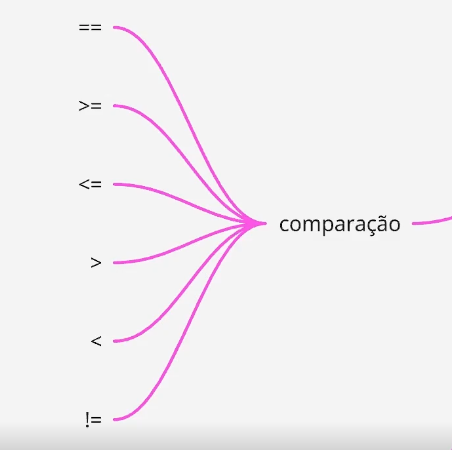

# Lógica de programação em JS

- `console.log()` é a forma mais básica de saída de dados em JS
    - pode rodar no proprio console
    - log é uma informação
- mostrar algo em JS chamamos de `print`
- para linkar o arquivo JS com o HTML, é só colocar a tag `script` com um `src` que referencia o arquivo
    - sempre é a ultima coisa antes de fechar a tag `body`
- para comentar, usar `//`

## Variáveis

- é comum precisar guardar informações do usuário etc enquanto usam nossa aplicação e pra isso usamos variáveis
    - ver mais sobre variáveis em [intro à lógica de programação](https://github.com/luhm/learning-code/blob/6a1932f887efd3902ff42c7fd177990def5ca660/til/programming/intro-logica-de-programacao.md) e em [algoritmos](https://github.com/luhm/learning-code/blob/0bc6cc26347120abfb9f0f57af63f8c4cf5e9c93/til/programming/algoritmos.md)
- **camelCase**: é o nome dado ao formato de nomeação das variáveis em JS:
    - sempre a primeira letra minuscula e a primeira letra das outras palavras, maiusculas
- **tipos primitivos**: number, string, boolean
- **tipagem dinâmica**: o JS entende o tipo de variável
- **tipagem fraca**: facilmente se confunde nos tipos, misturando textos e numeros
    - não retorna um erro
    - diferente do TS, que é mais forte
- **coerção de tipos**:
   - ele converte de numero para texto e para booleano (onde apenas o 0 retorna false, qualuqer outro numero retorna true)
   - se tentar converter texto para numero, ele não vai dar erro, mas vai aparecer a msg NaN (Not a Number)
   - explicita/manual: voce muda o tipo da variável usando a formula 
    ```javascript
    const nome = Novotipo(o que ele vai entregar)
    ex:
    const numeroDaIdade = Number(idade)
    ```
    - implícita: ele faz automaticamente
        - se tentar somar um numero com uma string, ele transforma tudo em string
        ```javascript
        console.log(1+"1")
        retorna 11
        ```
        - se não for soma, ele transforma o string em numero e faz a operação normal
- é **case sensitive**: não pode escrever com letra maiúscula, não devolve a mesma coisa

## Criando variáveis
- `var` - não é a melhor
    - é uma variável global e pode ser usada em qualquer lugar do código, mesmo antes de ser declarada
    - isso é o hoisting
- `let` ou `const` são as melhores
    - `let` permite que voce altere depois (let it change)
        - voce precisa ter a variável antes de declarar ela
    - `const` não permite mudar
- `prompt` cria uma pergunta para o usuário do navegador com uma caixinha

## Estruturas de dados

### Objeto

- uma variável que tem vários dados (propriedades), separados por virgulas dentro da chave
- sintaxe:
    ```javascript
    const pessoa = {
        nome: "Luiza",
        idade: 30
    }
    ```

### Funcoes

- serve para agrupar dados/informações

- podem ser escritas como

```javascript
function(x){
    y
}
```

- ou com arrow function

```javacsript
(x) => {
    y
}
```

- function declaration:
    - You are probably clear on this by now, but just in case, to actually use a function after it has been defined, you've got to run — or invoke — it. This is done by including the name of the function in the code somewhere, followed by parentheses.

### Array

- é um tipo especial de objeto em forma de lista de representantes daquela constante
    - pode ter variáveis de vários tipos: funções, arrays, numeros
    - para acessar um array dentro de outro, usa-se um `for-in` loop para cada array acessado
- os elementos de um array são acessados usando numeros
    - o primeiro elemento é sempre representado por 0
- sintaxe:

```javascript
const frutas = ["banana", "abacate", "laranja"]
```

#### Methods

- `.at(2)` depois do nome do array vai mostrar o elemento 2 (terceiro da lista, pois começa em 0)
    - se usar apenas o nome do array seguido de [2] dá na mesma
    - se usar numero negativo, acessa do final da lista
- usar o método `.toString` converte um array para uma string com os elemento separados por virgula
    - o métodop `.join(-)` é a mesma coisa mas o que vem entre parágrafos é o simbolo que vai separar os elementos do array
- `.pop` retira o ultimo elemento do array e retorna o elemento que foi retirado
- `.push` adiciona um novo elemento ao final
- `.shift` faz o mesmo que pop, mas ocm o primeiro elemento
- `.unshift` faz o mesmo que push, mas no início da lista
- existe o método `.delete()` porém ele deixa um bucaro no array, diferente de `pop` ou `shift`
- `.concat` une os elementos de diferentes arrays, criando um terceiro, completo
    - exemplo: array1.concat(array2, array3 ...)
    - é possível usar .concat para adcionar um novo elemento sem mexer no array original, apenas add novos elementos e criando um novo array
- `.copyWithin(a, b)` copia o elemento da posição `a` para a posição `b`
    - overwrites o valor ja existente naquela posição b, e com isso não muda o tamanho do array
- `.splice(a, b, c)` adiciona um novo elemento em uma posição específica do array, alterando o array original
    - a = onde o elemento deve ser inserido
    - b = quantos elementos devem ser removidos do array
    - c = elementos a serem adicionados
- `.toSpliced` é igual o splice porém cria um novo array e não modifica o antigo
- `.slice(a)` cria um novo array apenas com os elementos indicados (no caso, a partir de a)
    - se tiver apenas um argumento, será a partir dele, tudo que vem depois
    - a = numero do primeiro elemento retirado
    - a, d = são retirados os elementos de a até d, d excluído


#### Properties

- `lenght` mostra quantidade de elementos de um array
- `lenght -1` acessa o ultimo elemento
- `push()` adiciona mais um elemento ao final

## Operadores matemáticos

- usa os operadores normais de soma, subt, divisão e multiplicação
    - usa ** para fazer potencia
    - usa % para inficar resto de uma divisão
- usa uma biblioteca chamada [Math](https://developer.mozilla.org/en-US/docs/Web/JavaScript/Reference/Global_Objects/Math)

## Operadores booleanos

- fazem comparações
- usamos dois simbolos de igual `==`para comparar se são iguais
    - compara apenas o valor
    - `===`compara valor e tipo - **É UMA BOA PRÁTICA**
    - `=` simbolo só é a atribuição que fazemos nas variaveis
- usamos `!==` para falar de serem diferentes



### Conjunções logicas

- junta duas operacoes booleanas
- `&&`é o operador para AND
- `||`é o operador para OU
- se precisarmos imprimir um valor mas quisermos o oposto dele, é só colocar um `!`na frente
    - inverte a operação

    ```javascript
    console.log(!true)
    vai retornar falso
    
    console.log(numeroX >=18)
    ve se é maior de 18 e retorna verdadeiro

    console.log(!numeroX>=18)
    ve se é menor de 18
    ```
### Comparações

- sempre retorna true ou false
- números:
    - 
- strings:
    - ordem do dicionário/lexicográfica
    - [ver ordem](https://www.fileformat.info/info/charset/UTF-16/list.htm)

## Controle de fluxo e condicionais

- o fluxo de execucao normal é uma linha depois da outra

### if/else

- condicional
- se...senão
- **se** algo é verdadeiro, entáo uma coisa acontece, **senão**, outra coisa acontece

```if (a > 0) {
    result = 'positive';
  } else {
    result = 'NOT positive';
  }
```

- operador ternário
    - para quando a condicao if/else for muito simples
    ```javascript
    const idade=18
    idade >= 18 ? se veradeira : else
    ```
    - a interrogaao é como se fosse o if e os dois pontos representam o else
    - é possivel colocar dentro de uma variável, por exemplo:
    ```javascript
    cont idade = 18
    const mensagem = idade >= 18 ? "tudo certo!" : "aguarde fazer 18 anos!"
    ```

### switch...case

- switch...case
    - util quando a variável tem valor específico
    ```javascript
    switch(var){
        case ...
            break
        case ...
    }
    ```

### Truthy or falsy

- sao valores que podem ser considerados verdadeiros ou nao
    - um numero, por si só, é verdadeiro
    - um espaço vazio, é por si só, falso
- falsy: `0`, `undefined`, `null`, `""`, `NaN`
- todos os outros sao truthy

## Estruturas de repetição

- loops
- os mais comuns são `for` e `while`

### for
- sintaxe do `for`:
```javascript
for (let i = 0; i < 5; i++) {
    console.log(i)}
```
- para cada i que começa em 0, quando ele for menor que 5, voce vai colocar o valor de mais 1 no i, após fazer o que estiver dentro do for

### for ... of

- para loops em arrays e collections

```javascript
const cats = ["Leopard", "Serval", "Jaguar", "Tiger", "Caracal", "Lion"];

for (const cat of cats) {
  console.log(cat);
}
```
- onde para um conjunto chamado cats, pegue um e atribua à constante cat, depois faça o que está entre `{}`

### .map()

- pega os elementos de uma coleção e faz algo com eles até passar por toda a coleção
    - o retorno é um novo array
- exemplo:
```javascript
function toUpper(string) {
    return string.toUpperCase();
    }

    const cats = ["Leopard", "Serval", "Jaguar", "Tiger", "Caracal", "Lion"];

    const upperCats = cats.map(toUpper);

    console.log(upperCats);
    // [ "LEOPARD", "SERVAL", "JAGUAR", "TIGER", "CARACAL", "LION" ]
```

### .filter()

- cria uma nova coleção que contém apenas itens que passam por uma certa regra
- a diferença para o `.map()` é que ele passa por um teste booleano antes de criar a nova coleção

```javascript
function lCat(cat) {
  return cat.startsWith("L");
}

const cats = ["Leopard", "Serval", "Jaguar", "Tiger", "Caracal", "Lion"];

const filtered = cats.filter(lCat);

console.log(filtered);
// [ "Leopard", "Lion" ]
```

### While

- sintaxe do `while`:
```javascript
let contador = 0
while (contador < 3) {
    console.log(contador)
    contador++
}
```
- enquanto o contador for menor que três, eu vou rodar o que está dentro, até finalizar


## Bibliotecas

- a palavra/comando `require` é usado para importar bibliotecas no JS
    - declara em uma constante
    ```javascript
    const fs = require("fs")
    //onde fs é o nome da biblioteca
    ```
    - cada biblioteca tem um conjunto de funcoes especificas da biblioteca, que esta na documentacao dela
    - um exemplo, usando a biblioteca `fs` do `node.js` para ler um arquivo `json`:
    ```javascript
    fs.readFile ("nome.json", (erro, dados))  => {
        if (erro){
            console.log("erro", erro)
        } else {
            console.log(dados) //esse dados é um buffer com os dados do arquivo json
            //podemos colocar json.parse(dados) para transformar em um objeto de js
            console.log(typeof dados)
        }
    }
    ```
    - podemos usar `json.stringfy` se quisermos transformar o conteudo de uma funcao em string de json
- para instalar uma biblioteca pelo terminal, escrever: `npm install nomeDaBiblioteca`
    - se quiser colocar ela para ser apenas no periodo de dev e nao quando vai pro usuario, colocar `--save-dev` ou `-D`no final

## DOM


## JSON

- javascript object notation
- formatacao leve para troca de dados
- varias linguagens usam
- estrutura
    - chave-valor
    ```json
    {
        "chave":valor,
    }
    ````
    - lista ordenada de valores
- vantagens:
    - facil interpretacao e leitura
    - maior velocidade de execucao
    - tamanho reduzido
    - facil parsing
        - transforma o json em um algo tipico daquela linguagem (um objeto do javascript, dicionario do python)
- aplicacoes:
    - arquivos de configuracao
        - que tem dentro dele todas as configuracoes, tipo a do vs code
    - transferencias de dados entre aplicacoes
        - APIs
        
- o código `npm i json-server -g` instala um servidor json para rodar esses arquivos no projeto. O `-g` no final significa que ele é global
    - no windows ele dá erro
    - o npm a gente usa quando tem o node instalado no OS
    - com esse json-server a gente consegue criar apis e consumir elas atraves do JavaScript

## APIs

- Application Programming Interface
- se comunica com terceiros no seu codigo enviando um dado e recebendo outros em resposta
    - cep dos correios
    - google maps
    - login com google
- sempre consultar a documentacao para ver como funciona e as orientacoes
- tipos:
    - publicas ou abertas
    - privadas ou internas
    - APIs de parceiros
- protocolos de APIs
    - padronizam a troca de dados
    - REST é o mais comum
        - possui 6 restricoes
        - usa protocolo HTTP e conexao cliente-servidor
        - comunicacao stateless, que nao armazena info do cliente/requisicao
        - pode usar cache
        - padronizacoes
        - sistema em camadas e hierarquias (backend)
- caracteristicas
    - protocolo HTTP e url base (onde as infos estao)
    - formato de dados - normalmente vem em `JSON`, mas por vezes da pra escolher (xml, csv)
    - **Schema**: um esquema de como seu dado vai ser entregue
    - **autenticacao**: normalmente chave (APIKey) ou OAUTH
    - **endpoint**: URL completa para um recurso específico
        - quando o endpoint foir variavel de acordo com a escolha do usuario, podemos fazer uma funcao com isso e substituir no endpoint
- testar apis:
    - insomnia
    - postman
- API rest nao é a unica, podem ter apis do proprio navegador
    - aquelas caixinhas que aparecem perguntando se pode enviar notificacoes, é uma api do browser (notification API)

### Browser APIs

- DOM:
    - Document Object Model
    - é a organização da estrutura da página que faz com que o JavaScript leia o HTML
    - é uma árvore de objetos da página
    
    - os elementos HTML são vistos como objetos
    - possibilita o crud do html
    - favorece a representacao do html em nós e objetos
    - permite ser acessada por JS
    - árvore de elementos
    - para acessar por meio do JS precisamos colocar `document.oQueQueremos`


### Consumo de APIs

- fetch API
    - uma api do browser para fazer requisicoes para APIs via HTTP

## Selecionar elementos HTML no JS

- `document.getElementsByTagName("tagDoElementoHtml")` - pega todos os elementos com aquela tag
- `document.getElementsBayClassName("classeDoElemento")` - pega todos os elementos pela classe
- tem também by name e by id (name é tipico de inputs/formularios)
- se usar `.querySelector(#id ou .class)` podemos usar os seletores css como # pra Id e . pra class - **só pega um elemento, o primeiro**
    - o querySelector pega apenas o primeiro elemento que tem aquela classe/id - para pegar mais de um, usar `.querySelectorAll`
    - é mais usado para pegar pela classe do elemento, para ID pode usar o `getElementByID(id)`
- pode usar o html com `textContent` ou com `innerHTML`, da para pegar e também para alterar o conteudo daquela tag (textos de um paragrafo ou de um titulo, por exemplo)
- se eu quiser pegar algo dentro de um input (tipo uma caixa de email de formulario), eu posso colocar `.value`
- as vezes nao se usa o `document.` pois se usa dentro de qual elemento voce quer fazer aquela alteracao
- exemplos criando um novo item no html
    
    

- é possivel adicionar eventos
    - evento é tudo o que o usuário interaje na tela e o JS pega e manipula
    - a forma mais facil é adicionando um `addEventListener()` após um `element.`onde element pode ser, por exemplo, um botao do HTML
        - dentro dele, colocar primeiro o tipo de evento e depois qual a funcao que ele vai retornar (tipo um callback), por exemplo um alert (uma caixinha que abre na tela com uma msg)
        - o tipo de evento `click`, é porque foi clicado; `input` é porque foi digitado
    - sintaxe:
    ```javascript
    document.addEventListener ('input', function() {
        //o que vai ser feito
    })
    ```

## Paradigmas da programacao

- se refere a como o sistema roda o seu codigo
- prog paralela
    - cada thread do processador processa uma parte do codigo ao mesmo tempo
    - muito desafiador pois é comum que uma parte do codigo dependa de uma parte executada anteriormente

### programacao assincrona

- é uma forma de nao ficar parado enquanto um codigo esta sendo rodado/testado
- no JS tem 3 formas
1. Callbacks
    - funcao/chamada de retorno
    - quando o resultado dela estiver pronto, quando ele for lido, aí entao executa a funcao que tem nele
    - possui dois parametros - `erro` e `conteudoDoArquivo`
2. Promises
    - promessas - pode ser cumprido ou nao
    - um objeto no js que guarda essa promessa acima
    - possui 3 estados
        - pending - iniciada, mas pendente
        - fullfilled - concretizada, sucesso
        - rejected - rejeitada, erro
    - uso:
        - pegar dados do backend (funcao fetch, por exemplo, que é muito usada em APIs)
    - para criar uma nova, usar `new Promise`
    ```javascript
    const myPromise1 = new Promise(executor) //promise é com letra maiuscula porque é uma classe
    //onde executor é a funcao que sera executada pelo construtor, e tem sempre dos parametros, resolve e reject
    const myPromise1 = new Promise((resolve, reject) => {
        resolve(1111)
    }
    )
    ```
    - para ela apresentar o conteudo da promise, usar `myPromise1.then`e o then ira retornar uma funcao `() => {}` onde  parametro que estará dentro dos parenteses é sempre o conteudo resolvido da promise criada
        - para esse parametro, pode-se dar o nome que quiser
        ```javascript
        myPromise1.then((nomeDoParametroQueEuQuiser) => {
            console.log("Aqui está sua resposta", nomeDoParametroQueEuQuiser)
        })
        ```
        - exemplo de fetch API numa busca por artistas na pagina do spotify:
        
        - e a função que vai dizer o que fazer e como aparecer na DOM o resultado:
        

        - para pegar o erro, usar `.catch`
        - ao final, independente de dar certo ou nao, ele pode executar uma resposta usando `.finally`
 
3. resolvendo promises usando async/await
    - essa coisa X é assincrona (estou avisando para o JS) e eu quero que voce espere para executar o que vem em seguida
    - quando executamos uma funcao que possui coisas antes e depois dela, mas queremos esperar ela finalizar para entao continuar, colocamos `await` antes dela
        - mas nao pode fazer isso no corpo do codigo, apenas dentro de uma funcao assincrona
        - se colocar `async` antes de uma funcao, torna ela assincrona, e com isso é possivel colocar o `await`
        ```javascript
        await funcaoAsync () //nao funciona

        async funcaoX () {
            await funcaoAsync()
        } //isso aqui funciona
        ```
        - para nao correr o risco de ter problema por causa de um erro na funcao que tem o await, usar `try {}, catch{}`
        ```javascript
        await funcaoAsync () //nao funciona

        async funcaoX () {
            try {
                await funcaoAsync()
            } catch(err) {
                console.log("deu esse erro", err)
            }
        } //isso aqui funciona
        ```


