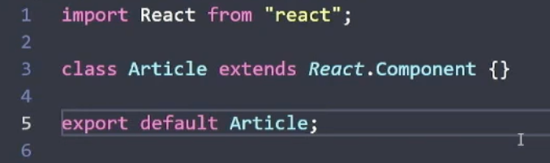
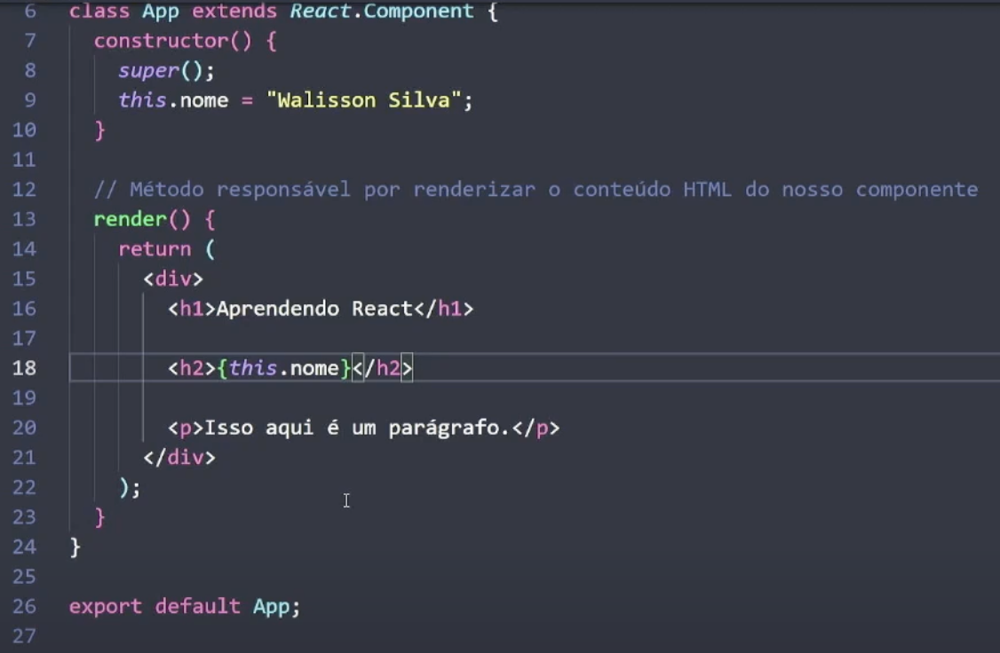
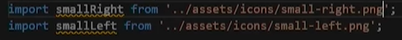
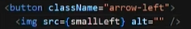
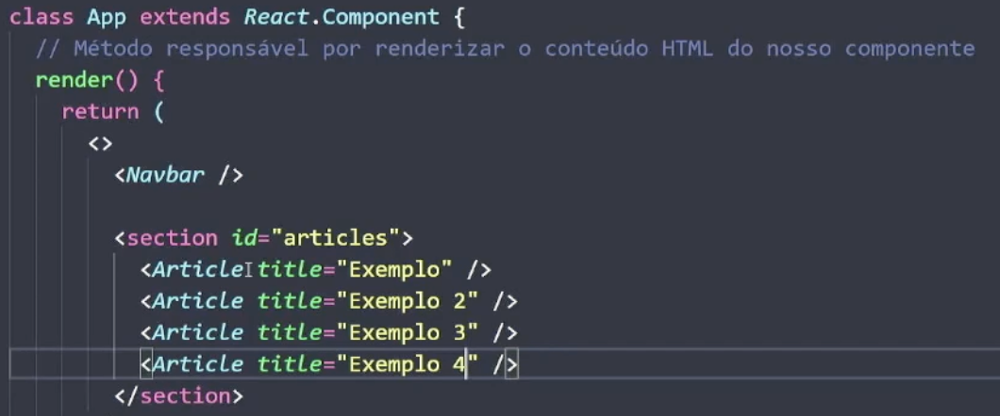
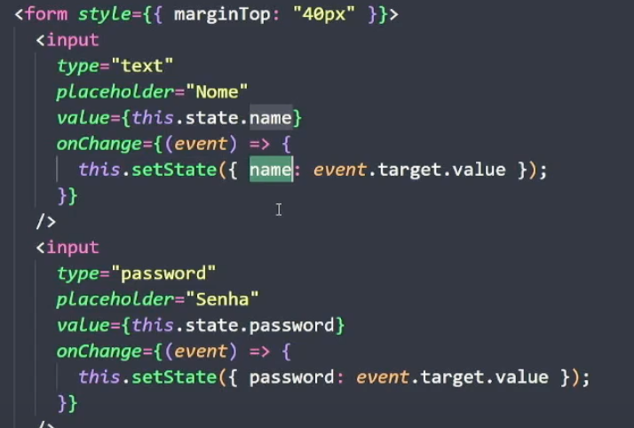

# React.js

- é uma biblioteca do JS
- flexível
- desenvolver interfaces de usuario, nao apenas web
- derivam do react
    - react Dom - web
    - react Native - mobile
    - electron - pra desktop
    - react TV - para tvs
    - react VR - realidade aumentada
- declarativo
- component-based
    - pequenos pedacos para desenvolver algo complexo
    - por exemplo, um site pode ter partes como header, body, footer
- aprende uma vez, escreve em qualquer lugar
- compilers - compilacao
    - usa o babel
    - no ts usamos `private` em um atributo, no react ele transforma isso pra `#` antes do atributo
- bundlers
    - usa o webpack.js
    - pega vários codigos JS e transforma em um só
- importacao de infos de outros arquivos
    - o React usa ESmodules, e nao o CommonJS
    - sintaxe ESmodules: `import { informacao } from "./arquivo.js";`
- um arquivo componente do React tem extensao `.jsx` e o nome comecao com letra maiuscula
    - na estrutura do react, `.jsx`, mistura html e javaScript no mesmo arquivo
    - uma função JS tem dentro dela um return com um codigo html(por exemplo uma div) dentro


## Comecando um projeto 

- usar o terminal direto e nao do vscode
- seguir as orientacoes que estao na [documentacao](https://react.dev/learn/start-a-new-react-project)
    - essa documentação traz o react com algum framework (next.js, gatsby) que já dá uma boa estrutura para trabalhar com react
    - para começar do 0:
        1. abrir o terminal do pc, não do vscode
        2. já com node instalado na máquina, digitar `npx create-react-app nome-do-projeto` onde npx é o executor do npm
- no React, tudo gera em torno de app.js, e esse app é renderizado dentro do `root` do html
    - ele vai tendo vários arquivos que tem um fluxo de renderizacao que utiliza infos de varios arquivos que ficam na pasta src do proprio react
- trabalho com singlepage application - padrao de renderizacao
    - se quiser mais de uma pagina, ele usa o JS
    - outros tipos: SSR (server side rendering) e SSG (server side generation)
- virtual DOM - o proprio react já cria esse virtual dom que facilita no carregamento dos dados

## Construindo o projeto


- acima está a estrutura básica de um doc react
- sempre que quiser pegar algo do JS e usar no HTML (para que o conteudo dele, por exemplo de um atributo de um objeto, apareca no html) é só colocar ele entre `{}`

- quando usar uma classe na parte de html do .jsx, usar `className`, `id` nao muda
- quando usar uma imagem no html (tipo o logo), fazer um import dela no react
    - fica mais ou menos assim:
    
    - depois adiciona no`src`da tag `img` (ou de outra, como a `a`) do html com `{}`:
    
- da para estilizar dentro direto do html do react
- ao final é sempre importante exportar a constante que voce estava mexendo

## Tipos de componentes

- react legado usa basicamente apenas classe, e nao function
- baseados em classes - inicia com `class`
    - é uma classe que herda (usando `extends`) a classe `Components` do react e retorna HTML
    - todos esses tem um metodo praticamente obrigatorio, que é o `render() {}`
        - é o metodo que renderiza o que voce quer na tela
        - para colocar mais de um componente no `render`, é necessário usar uma tag e dentro dela colocar os componentes, pois o render só aceita um componente "primario"
            - para isso existe a tag `< >` sem conteudo, chamada `fragment`
- baseado em funcoes - inicia com `function`

## Props

- vem de propriedades
- passar dados para dentro de um componente
- nesse exemplo, criamos a prop `title` que em cada versao do artigo tem um nome, o que faz com que ele apareça na pagina renderizada com esses nomes diferentes
    - para isso acontecer precisa colocar, no lugar do titulo original do `.jsx` referente a esse article, {this.props.nomeDaNovaPropriedade}


## Estados

- é uma variável que, especificamente, o react fica monitorando pra saber se mudou o estado dela e aí ele atualiza a renderizacao dela
- ele nao fica monitorando todas se nao a renderizacao seria muito pesada e ele seria pouco performatico
- dentro do constructor a gente cria um objeto com `this.state`
    - a sintaxe disso é:
    ```javascript
    export class Nome extends ClasseAntiga.Component{
        constructor() {
            super()
            this.state = { variavel }
        }
        render() {
            return (
            ...
            this.setstate({ contador: this.state.contador mudançaQueQuerFazer})
            )
        }
    }
    ```
## Formulario

- pegar infos de um formulário:
    - usando estados
    - colocando no constructor, já tem o `this.state` e dentro ja tem uma variárel, mas pode ter 2 ou 3
    - o `value` do campo do formulario vai ser `this.state.variavel`
    - para pegar o evento de digitacao do usuário, é só colocar nos atributos do `input` do formulario, um atributo especifio `onChange` que terá uma funcao dentro dele
        - aí usamos `(event) => [event.target.value]` como no exemplo mais complto abaixo
    

## Ciclo de vida

- fluxo de renderizacao
    - todas as etapas que o componente passa
- auxilia na otimizacao
- 3 fases:
    - montagem
    - atualizacao
    - desmontagem
- possuem métodos especificos para cada fase
- métodos:
    - montagem - construtor (sendo construido )
        - `componenteWillMount`
        - `componentDidMount`
        - `render`
    - atualizacao - render
        - pode usar funcoes com condicionais if...else


- [React JS - Documentary](https://www.youtube.com/watch?v=8pDqJVdNa44)
