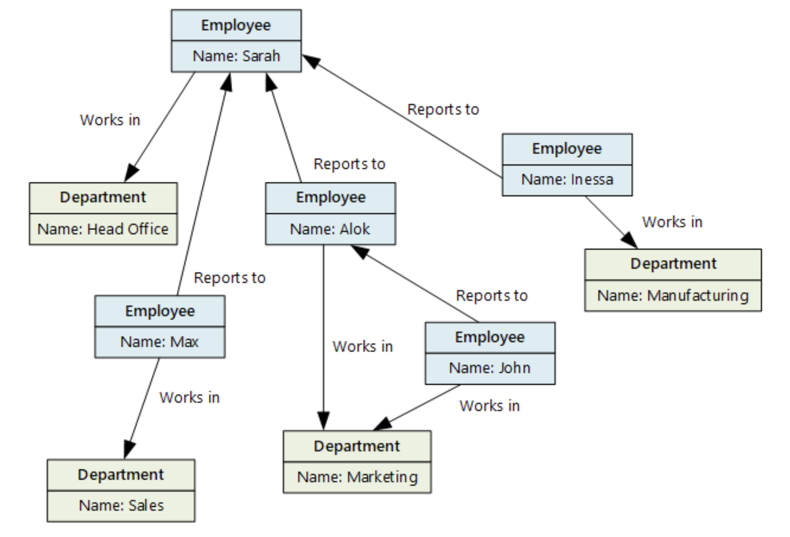

# Bancos de dados relacionais e não relacionais

- o que é banco de dados relacional
    - organizado em tabelas
    - relações pre-definidas entre o conteudo
    -  facilita a visualizaçõ e compeensão
    - possuem:
        - chaves primárias (PK - primarykey)
            - identificação unica dela
        - chaves estrangeiras (FK - foreign key)
            - identificação de outras tabelas que se relacionam com ela
        - colunas (campos)
        - linhas (registros)
    - exemplos: MariaDB, Oracle, PostgreSQL, MySQL
    - maior integridade dos dados, não aceita qualquer tipo, dados bem estruturados
- SQL - Stuctured Query Language
    - linguagem pra se comunicar ocm banco
    - operações: seleção, inserção, atualização, exclusão
- bancos de dados não-relacionais - no-SQL
    - lidar com volume alto, diferentes tipos de dados, dados desorganizados
    - flexibilidade, aceita qualquer estrutura de dados, escalabilidade
    - por exemplo os dados de um projeto que está no inicio ainda e não é possivel prever
    - são vários tipos
        - chave-valor
            - não é linha e coluna, e sim como um dicionário que tem o conceito, e retorna um significado
            - DynamoDB, Azure Table Storage
            - BigData
        - colunas
            - colunas e não em linhas
            - consultas analiticas
            - Cassandra, HBase
        - Grafos
            - redes sociais, bioinformatica e bancos semânticos
            - vértices e arestas
            - relacionamento por meio de atributos
                - parecido com relacional
                
            - Arango, Virtuoso, Neo4J
        - documentos
            - um dos mais comun para volumes de dados muito grande
            - um objeto com varias informações (objeto no sentido de JS)
            - MongoDB, CouchBase, IBM Domino
    
