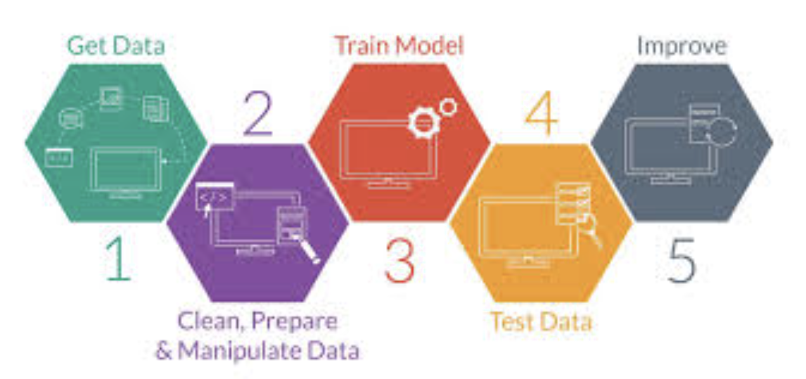

# Machine Learning e Dados

> sabe aquela recomendação de amizades que temos no Facebook? Machine Learning. Recomendação de livros quando abrimos o site da Amazon? Machine Learning! Indicações do que ver da Netflix pro fim de semana? Machine Learning!

- ML é uma subárea de AI
    - os algoritmos recebem a habilidade de aprender com os dados sem serem explicitamente programados
    - encontra padrões nos dados
    - prever, classificar ou agrupar novos dados
- o conceito de **modelo** é: o resultado do trabalho de profissionais que são cientistas de dados, que selecionam o melhor algoritmo para resolver seu problema, treinam e ajustam
- **Pandas** é uma biblioteca que estrutura os dados em um formato parecido com uma tabela de um banco de dados
    - linhas = observação
    - colunas = variáveis
- **Atributos** são as variáveis que vamos fornecer como entrada pro modelo
- pipeline de um projeto em ML:

- problemas comuns:
    - overfitting: quando seu modelo não generaliza bem para novos dados
        - performa bem no treino, mas não nos testes
    - underfitting: baixa taxa de acerto mesmo no subconjunto de treinamento
- 3 formas de aprendizado de máquina (para saber mais, [aqui](https://dev.to/aigirlsbr/afinal-o-que-e-machine-learning-ih5))
    - supervisionado
        - uma pessoa “professora” ensinando para a máquina
        - temos duas variaveis X e Y relacionadas
    - não supervisionado
        - a máquina precisa aprender por si mesma os padrões e tendências existentes nos dados
        - não te a variavel Y
    - por reforço
        - a máquina aprende através de feedbacks sobre os resultados que ela teve

- como aplicar cada algoritmo
    - se Y é um número contínuo e é preciso **olhar para o passado** para prever o futuro, use algoritmos de regressão
    - para **problemas de classificação**, saber se um personagem é vilão ou herói, eu posso usar: Árvore de decisão, regressão logística, KNN, SVM, Naive Bayes entre outros.
    - quando **não há certeza da saída** do modelo, pode-se usar algoritmos de agrupamento
- importante saber a matematica por baixo dos panos
