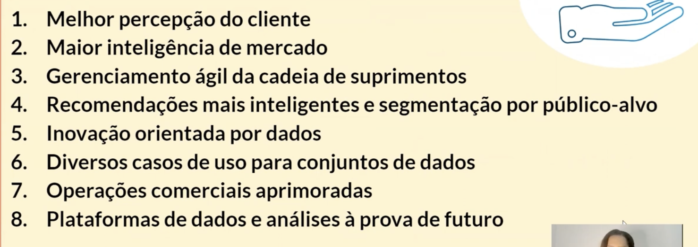

# PROCESSOS ÁGEIS EM DADOS

- desenvolvimento de produtos é sobre pessoas
- o que é produto?
  - pode ser vendido no mercado
  - atende desejos e necessidades
- o que é mercado?
  - clientes, concorrentes e fornecedores - os stakeholders
- dados auxiliam na construção de personas
- dados validam hipóteses tidas em reuniões de brainstorm
  - análise swot, mercado-alvo, métricas de uso, reconhecimento, sentimento e comportamento de usuários
- product analytics
  - análise de produto baseada em dados
  - agilidade = design thinking (pensamento de projeto) com etapas que convergem e divergem até o prototipo
  - métricas de sucesso
- no design - protótipo
  - MVP
- nos testes
  - qualidade, riscos
  - com base no mapeamento do publico alvo
  - segmentação de clientes
- lançamento
  - feedback
- teste A/B 
  - criação e teste de produtos
  - buscar melhor versão
- diminui erros, simplifica processos, eleva satisfação
- data driven
  - muitas consideram importante mas não olham com cuidado pros dados
  - quem olha com cuidado tem vantagem competitiva

- Benefício de **dados** na criação de produtos

- Benefício de **agilidade** na criação d eprodutos

## Metodologias ágeis

- scrum, kanban são os mais usados
  - scrum
    - framework, estrutura
    - problemas complexos
    - ajuda no reajuste de rotas no decorrer do desenvolvimento do produto
    - ciclos curtos
    - boas práticas: transparencia, inspeção e adaptação
  - kanban
    - cartão, placa, sinalização
    - sistema de visualização usado com o scrum
- visão de produto --> backlog --> sprints de backlog
  - sprints de backlog: 
    - 15 a 30 dias
    - pequenas entregas d evalor do MVP
    - daily de 15min
    - reunião com time de produto
    - reunião de planejamento
    - review para os stakeholders
    - retrospectiva
  
