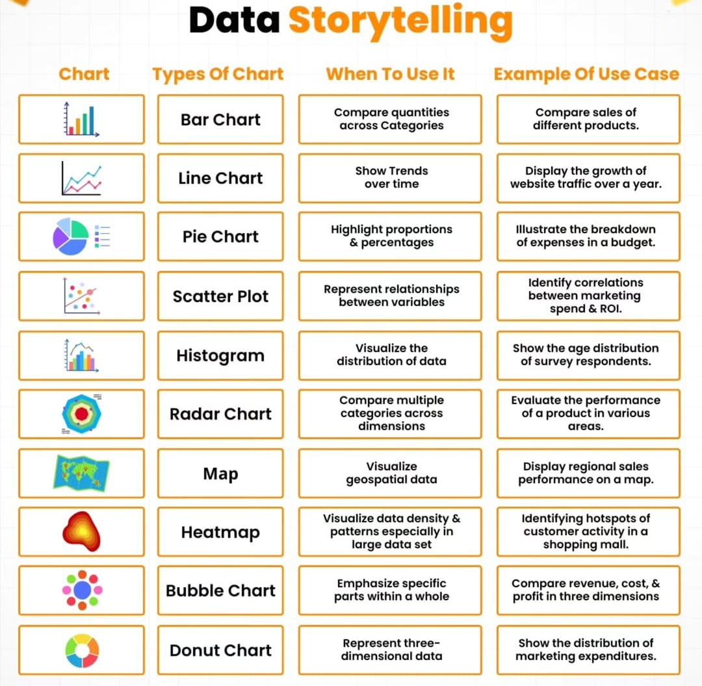

# Passo a passo para uma análise de dados

1) identificar o fato e a dimensão
- fato = o que aconteceu
    - em uma tabela
- dimensão = as colunas da tabela do fato
    - dimensão de tempo =  dia, mês
    - dimensão de produto = categoria, cor, peso
    - dimensão de localização = cidade, estado

2) Tipo de análise
- descritiva
- diagnóstica
- preditiva
- prescritiva

3) Combinação de fato + dimensão\
a. qnt de vendas por mes (mostre crescimento)\
b.  qnt de vendas por categoria (mostre comparação)\
c. vendas por mes (intensidade, onde vende mais)

4) Definir ferramentas\
a. linhas\
b. barras\
c. mapa de calor\

5) Painel final
- fazer um rascunho
    - pensar num formato de Z
- em cima:
    - macro
    - infos gerais
- em baixo:
    - micro
    - detalhamento

## Refs

[Esses são os 5 PASSOS para fazer uma ANÁLISE DE DADOS](https://youtu.be/-zHK3e45cI8?si=TcRdGkxqApMt-i3q)

