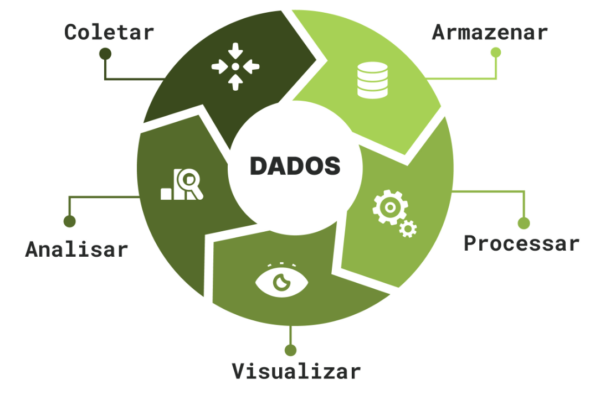

# Base Teórica de dados

1. O que são dados? Quais são suas fontes? O que define análise de dados?

**Dados** são informações - que podem ser numericas, textuais, de vários tipos - que são gerados a partir das ações e interações de pessoas ãs quais o produto se destina (que podem ser clientes, funcionários, usuários etc) com os produtos em si (que podem ser produtos físicos, serviços internos de uma empresa, externos, etc).

As **fontes dos dados** são de onde vem os dados, onde eles são produzidos, e podem ser diversas: documentos, formulários, ações em sites (cliques, páginas visitadas), informações sobre pessoas (funcionários, clientes). Basicamente tudo é dados e as fontes podem ser muitas.

**Análise de dados** é avaliar os dados para conseguir informações relevantes para o negócio e a empresa, usando tecnicas e ferramentas específicas, normalmente com uso de gráficos e estatística. Existem alguns tipos de análise de dados:
- preditiva
- prescritiva
- diagnostica
- descritiva

2. O que é business intelligence?

É um modelo de tomada de decisões de forma cuidadosa, usando dados e informações importantes do negócio, usando tecnologias e ferramentas específicas para isso. A análise de dados faz parte do BI, ajudando a entender a realidade do negocio e definir objetivos a partir da realidade.

Tópicos em que ele pode ajudar:
- Identificando formas de aumentar os lucros
- Analisando o comportamento dos clientes
- Comparando dados com a concorrência
- Acompanhando o desempenho
- Otimizando as operações
- Prevendo o sucesso
- Identificando tendências de mercado
- Descobrindo erros ou problemas

Processos tipicos de BI:
- Definir Objetivos
- coleta de dados
- armazenamento adeuqado e centralizado
- ETL - extract, transform, load
- visualizar - gráficos e métricas
- análise de dados, das visualizações, insights

Ferramentas:
- Data warehouse - onde vai o dado bruto, é organizado e estruturado
- excel
- Power BI
- linguagens DAX, M

3. Quais são os diferentes escopos na área de Dados?

- Engenheiro de dados - trabalha com extração, ingestão e na ponta de infraestrutura para esses dados
- Cientista de dados - trabalha mais com análise dos dados voltado para predizer, olha mais pro futuro, utiliza ferramentas de AI, por exemplo.
- Analista de dados - trabalha com entender, interpretar e tirar insights dos dados para responder perguntas de negócio e entender porque o negocio está como está, e apontar ideias e caminhos.
- Engenheiro de ML - constroi ferramentas para serem usadas principalmente pelo cientista de dados
- Analista de BI - está mais perto do negócio e olha de forma mais ampla para as perguntas e os objetivos do negócio, analisa os insights e constroi como colocar eles em prática.
- Arquiteto de dados - constroi a estrutura dos dados do inciio ao fim

4. O que é o negócio e como se relaciona com a área de Dados? Quais são os principais modelos de negócio?

Negócio é uma atividade comercial, financeira e que oferece produtos e/ou serviços. Dentro de uma empresa grande, é possível ter diferentes modelos de negocio dependendo do serviço ofertado e o publico. Os dados são elementos importantes para a tomada de decisão sobre o negócio e sobre como dar seguimento a ele, fazer mudancas, etc.

Principais modelos de negócios:
- B2C -  business to consumer - Negócios que vendem para o consumidor final, como mercados
- D2C - direct to consumer - quando a propria fábrica, quem produz os produtos ou serviços, vende para o cliente, como em lojas de fábrica ou outlets
- B2B - business to businnes - quando o serviço ou produto é vendido para outras empresas
- P2P - peer to peer - empresas que servem de espaço para conexão de pessoas, e normalmente ganham dinheiro a partir de anuncios
- Franquia - a pessoa compra a marca e o que ela entrega, por exemplo BK ou Giraffas
- Assinatura - A pessoa consegue o serviço a partir de uma assinatura, como na netflix
- Freemium - a pessoa tem acesso ao serviço de graça, porém se ela pagar ela tem benefícios, como spotify e slack
- Isca e Anzol - o carro chefe é caro e tem valores agregados, porém para que ele seja cada vez melhor e mais aproveitável, vende-se vários suportes e adereços
- Negocios sociais - são negócios que visam ajudar/resolver/afetar problemas sociais como analfabetismo ou poluição
- SaaS - Software as a service - são softwares que promovem serviços digitais que vão além da compra de um software, mas com desenvolvimento contínuo, manutenção 
- Marketplace - são espaços de venda online, lojas virtuais, como amazon e mercado livre
- Plataforma Multilateral - são negocios que oferecem serviços para diferentes partes, conectando elas e gerando valor para ambas, como Ifood e Uber

5. O que é LGPD?

Lei Geral de Proteção de dados - protege informações sensíveis de pessoas e negócios. fala sobre privacidade, uso e tratamento de dados

## Refs

### Análise de dados

- https://www.alura.com.br/empresas/artigos/analise-de-dados?srsltid=AfmBOop_5ahp7l42lz6bT9UpotN9CxoHpyJTQT3md_kcsx3GQLtzWg_B
- https://www.cortex-intelligence.com/blog/inteligencia-de-mercado/o-que-e-analise-de-dados
- https://escoladedados.org/tutoriais/mas-o-que-significa-isso-introducao-a-analise-de-dados/
- https://aws.amazon.com/pt/what-is/data-analytics/
- https://ebaconline.com.br/blog/analise-de-dados-metodologia-tecnicas-tipos

### BI

- https://www.alura.com.br/artigos/business-intelligence?utm_term=&utm_campaign=topo-aon-search-gg-dsa-artigos_conteudos&utm_source=google&utm_medium=cpc&campaign_id=11384329873_164212380672_703829166693&utm_id=11384329873_164212380672_703829166693&hsa_acc=7964138385&hsa_cam=topo-aon-search-gg-dsa-artigos_conteudos&hsa_grp=164212380672&hsa_ad=703829166693&hsa_src=g&hsa_tgt=aud-2200131122553:dsa-425656816943&hsa_kw=&hsa_mt=&hsa_net=google&hsa_ver=3&gad_source=1&gbraid=0AAAAADpqZIAPek9aH0s0S-l9QuLmptqpq&gclid=CjwKCAjw5PK_BhBBEiwAL7GTPXXpW3cCR_CUMMnNAowmr5op-PirbkJa-NA0fQPGfHGFqbnFHzNeJhoC1XUQAvD_BwE
- https://www.tableau.com/pt-br/learn/articles/business-intelligence
- https://www.ibm.com/br-pt/topics/business-intelligence
