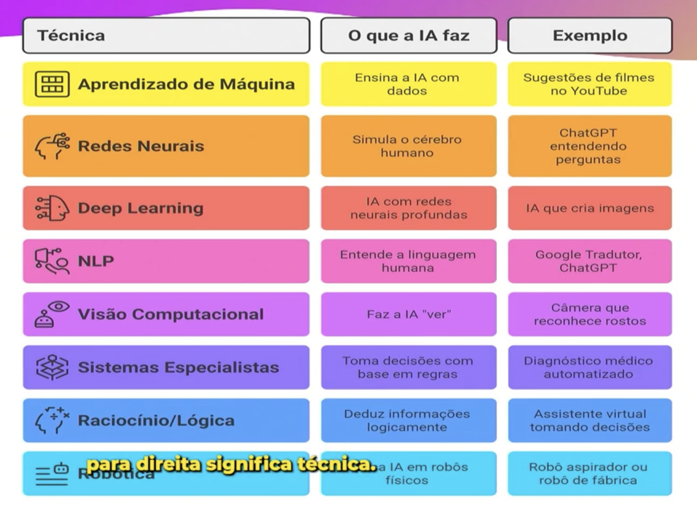
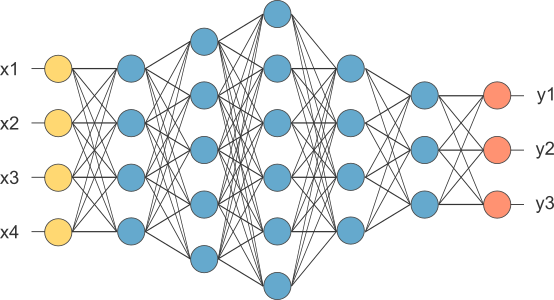
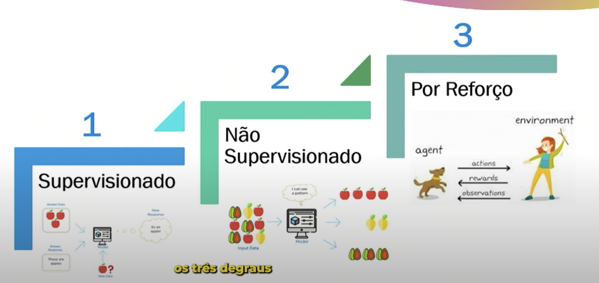

# Inteligência artificial

- imediatismo dita o desenvolvimentos das tecnologias e a nossa necessidade sobre ela
    - demonstrou sucesso
- a IA já prepara as coisas pras pessoas
    - executa tarefas que normalmente exigem a inteligencia humana, o pensamento humano
    - ela aprende com erro e experiencia
    - entende linguagem natural
    - reconhece padrões
    - resolve problemas, possui conhecimento, sabe como fazer
    - adaptação a mudanças
- campos em IA
    - 
    - 
- vemos IA em vários lugares
    - recomendação de produtos em sites de compra, netflix, youtube
    - no google, ao pesquisar por audio ou foto
    - chat gpt, alexa, assistentes virtuais do wpp, facebook, google assistent, siri
- redes neurais:
    - são programas que processam como o nosso cerebro
    - pegamos muitos arquivos de qualquer tipo
    - são tranfosmados em numeros, analisados, devolvem em numeros de resposta e retransformados em arquivos que precisamos
    - 
- como ensinar algo ao computador
    - supervisionado : voce aocmpanha o pc ao aprender e da os feedbacks
        - marca a parte da imagem que é prioritária, que é onde ele vai focar o aprendizado pra conseguir focar no que encontrar
        - coloca varias imagens do mesmo objeto, sempre marcando ele, para que o computador entenda que é aquilo que ele deve compreender
        - 
    - não supervisionado
        - por classificação
        - apresenta vários tipos do mesmo objeto, passa pelo processamento de rede neural, e ele separa as que são mais proximas
        - reconhece diferentes padroes
        - existe 2 tipos de separação
            - classification : separa todos os tipos
                - tem vários animais, e separa cada tipo de animal
            - clustering: agrupa todos que são de tipos espefícos
                - tem vários animais mas agrupa eles em mamiferos e aves, por exemplo, separando os doi grupos
    - por reforço
        - da pontos quando ela aprende, pune quando não aprende
        - aprende o que é bom ou ruim, certo ou errado
        - usa politicas que definem a ação, recebendo ao bom ou ruim
            - atualiza a política ao saber que aquilo é bom ou ruim

