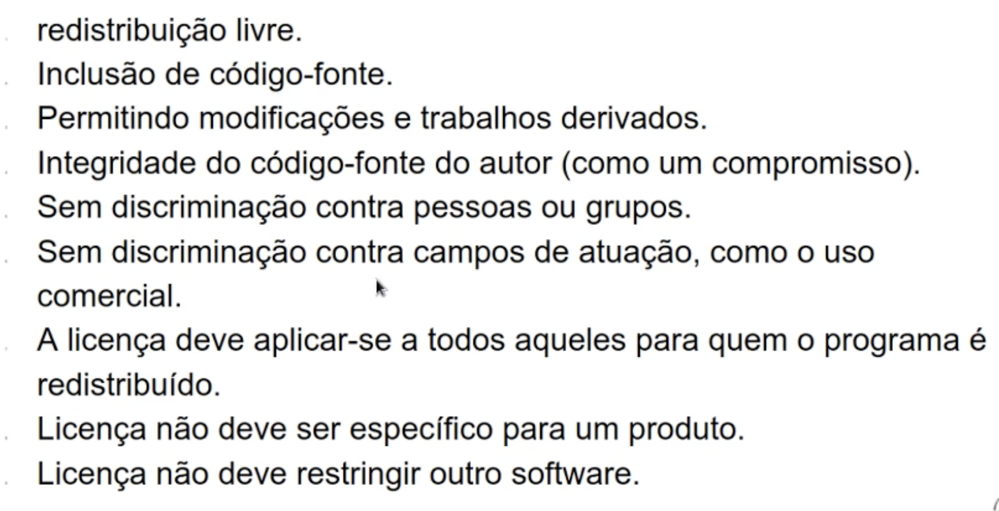

# Linux Essentials

- alta performance
  - as áreas são ativadas conforme vamos usando, e não ficam ali o tempo todo pesando tudo
- utilizado também pelo google e pelo android

## Conceitos

- Linux é só o kernel
  - as distribuições são construidas em cima desse kernel
- tem diversas licenças que garantem a distribuição e a gratuidade
  - geram restrições também.
  - as licenças mais restritivas são GPL
  

- GNU
  - projeto visinario de software livre
  - liberdade de distribuição

- DFSG
  - Debian Free Software Guideline
  - criterios para serem distribuidos na Debian
  - redistribuição livre
  

- BSD
  - conjunto de ferramentas e sistema operacional
  - faz parte do sistema linux
  - 

## Linux e Shell

- ele conecta na sua máquina pelo comando `ssh usuario@ip.da.maquina`
  - quando a linha de comando inicia com `$` é porque é um usuário comum autorizado que está ali trabalhando
  - quando inicia com `#` é porque é o admin
  - para mudar do comum pro admin, usar o comando `su -` - su vem de superior user
- usamos o shell para interagir com o Linux pelo terminal
  - é como uma "linguagem" no mesmo sentido do git
  - bash, zsh, etc tem comandos diferentes, todos são tipos de shell
- existem padrões para que voce consiga trabalhar e todas
  - FSH - hierarquia de diretórios que se usa em todos os linux
  