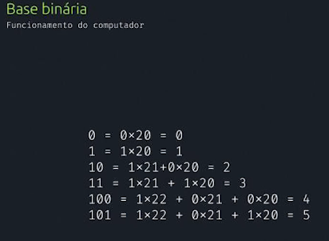
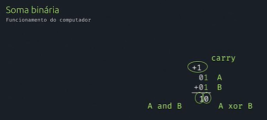

# Física dos computadores

- o principal material é o silício
- material condutor (sinal eletrico, como cobre)
- material isolante (da corrente eletrica, borracha)
- semicondutor (silício, dependendo de como ele é manipulado)

## Silício

- muito abundante
- normalmente oxido de silicio
- átomos do silício
  - ligações covalentes com outros átomos de silício
  - após purificado, é colocada uma quantidade controlada de impureza
  - faz-se cristais n ou p (neg ou pos)
- CMOS
- MOSFET
- tecnologia espacial não usa silício
  - mais dificil de dissipar calor
  - ligas de metais

## Lógica

- booleana
- valores verdadeiros ou falsos
- operações
  - e - and
    - ligação entre duas expressões
    - a primeira verdade e a segunda também
  - não - not
    - inverte o valor lógico
  - ou - or
    - uma das coisas deve ser verdade
    - as duas podem ser verdade, mas só uma basta
  - ou exclusivo - or... or - xor
    - não vale se as duas forem verdadeiras
- 1 é verdadeiro, 0 é falso

### na computação

- uso de transistores
  - com canal positivo ou com canal neg
  - canal pos recebe com menor tensão
  - canal neg conduz com tensão maior
- alta tensão 1
- baixa tensão 0
- inversor:
  - os componentes eletricos de acordo com a logica booleana e o recebimento de energia/tensão
  - se ligar em série, temos and
  - se ligar em paralelo, temos nand
  - nand = not and
  - a bolinha simboliza o inversor
  - 
  - or e nor
  - 
  - xor
  - 
- assim como nós usamos base numerica decimal, com 10 algarismos numericos e depois eles se repetem, o computado usa apenas dois algarismos (0 e 1), os dos transistores
  - na imagem abaixo, 20 é o mesmo que 2^0
  - 
  - soma binária:
    - 

## Linguagens de programação

- Assembly
  - baixo nível
  - funcionamento do computador
  - muda de acordo com a arquitetura do computador
- Python
  - alto nível
  - mais próximo do ser humano
- C
  - foi considerada de alto nível
  - antiga
  - trabalha proximo do sistema operacional
- compilação
  - compila a cada atualização
  - transforma a linguagem em baixo nível
- interpretação
  - não traduz todo o seu programa
  - carrega o codigo de alto nível no interpretador que diz pro pc o que fazer
  - JS, Java
  - pode ter algumas ferramentas do compilador
- bibliotecas de códigos prontos
  - estabilidade de código
  - diminui tempo
- sistemas embarcados:
  - sistemas que controlam outros sistemas/computadores
  - exigem maior segurança e cuidado
  - arduíno
    - prototipagem do sistema final
    - é um "minicomputador"
- O infinito é um problema na computação pois o computador não consegue trabalhar direito com números muito grandes, o que exige muita memoria e processamento
  - por isso se usa o numero flutuante, que voce coloca quantas casas decimais ele vai considerar para fazer esses calculos
  
