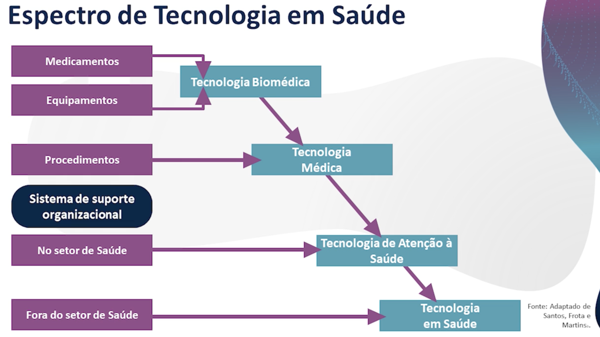

# Tecnologias em Saúde - Conceitos e Classificações

- Tecnologia pressupões o "saber fazer", algo pratico
    - parte de dados, decisões, informação
- 3 camadas:
    - objeto
    - forma de conhecimento
    - conjunto complexo de atividades humanas
- tecnologia em saude perpassa diagnostico, tratamento e recuperação
    - inclui produtos e insumos - vacinas, dispositivos, materiais
    - procedimentos preventivos, clinicos, cirurgicos etc
    - cuidados em geral
    - modelos de organização
- classificaçoes:
    - tecnologias biomedicas
        - de senso comum, interagem diretamente com o paciente
        - usados pelos profissionais de saude
        - medicamentos
    - tecnologias medicas
        - aperfeiçoamento das tecnicas de uso dos proprios medicos
        - laparoscopios
    - tecnologias de atenção à saude
        - estrutura de apoio tecnico, administrativo
    - tecnologias em saude
        - rede de apoio à saude
        - saneamento basico, controle ambiental, direitos trabalhistas

## Tecnologias em saude

- leves: produção de vinculo
    - autonomia do cliente
    - acolhimento
    - relacionamento interpessoal
- leve-dura:
    - saberes estruturados
    - interaCão a partir de certas normas especificas
    - costuma ser usada em especialidades especificas
    - pediatria, geriatria
- dura:
    - equipamentos, máquinas

