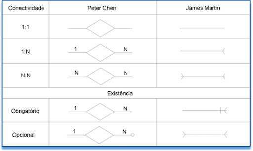

# Relacionamento entre tabelas

- conectividades:
    - 1:1
    - 1:N
    - N:N
- existência da conexão
    - obrigatoria
    - opcional
- formas de notação:

- tipos de dados usados:
    - uuid - é um hash - tipo de codigo que tranforma um arquivo em algo hnumerico
    - varchar (também string) - limite de caracteres
    - text - bloco de texto
    - date
    - enum - enumerate - multipla escolha, escolhido em uma lista, mais ou menos 0 extrutura salva no banco
    - timestamp - data + hora
        - pode ter limitações do proprio banco ou biblioteca, mas no geral se escolhe os detalhes
- deleted_at
    - hard delete - realmente apagar do banco de dados
    - soft delete - marca como deletado, mas não apaga mesmo

