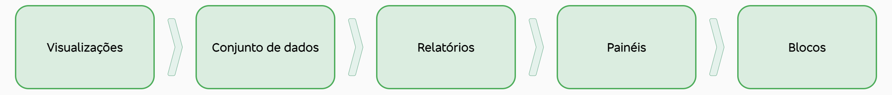
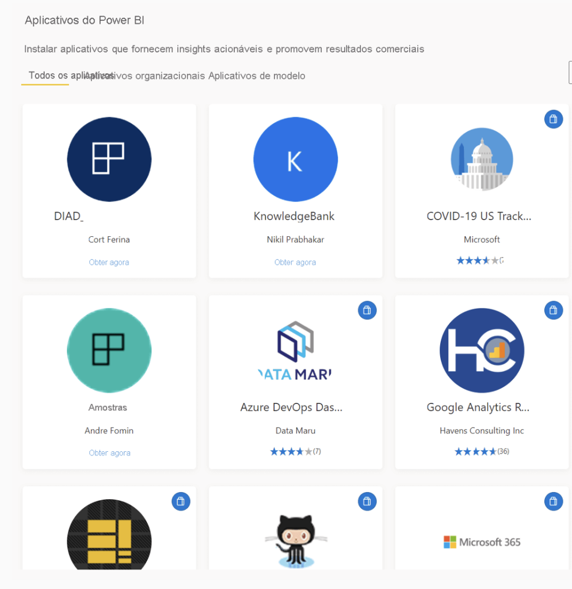

# Análise de dados - Fundação Bradesco - Escola Virtual

- processo de identificação, limpeza, transformação e modelagem de dados
- dados devem vir de fontes confiáveis
- Narrativa
    - importante pensar em para quem está fazendo, e construir a melhor forma de fazer a narrativa para aquelas pessoas
    - poder de impactar, mostrar novas ideias e descobrir o valor oculto dos dados
    - feita a partir dos dados
    - por meio de relatorios
- tipos de análise
    - Descritiva: historica, o que aconteceu, resultados
        - KPIs - key performance indicator (?) - sucesso ou falha dos objetivos
        - ROI - retorno sobre investimento
    - diagnóstica: porque certos eventos acontecem
        - usam as conclusões de análises descritivas
        - investiga mais a fundo os indicadores de desempenho
        - 3 etapas:
            1. Identificar anomalias nos dados, como alterações inesperadas
            2. coletar dados sobre essas anomalias
            3. Identificar anomalias nos dados que explicam a anomalia
    - preditiva: o que acontecerá no futuro
        - identificação de tendencias
        - possibilidade de que certas coisas se repitam
        - tecnicas estatísticas e de ML - redes neurais, árvores de decisão e regressão
    - prescritiva: quais ações devem ser executadas para atingir o objetivo
        - tomada de decisões, mesmo em meio a incertezas
        - probabilidade de diferentes desfechos
    - cognitiva: inserir na base de dados as conclusões das primeiras descobertas
        - loop de comentários e autoaprendizagem
- funções principais:
    - preparar os dados, com limpeza, transformação e criação de perfis.
        - acontece com os dados brutos
        - garante a integridade dos dados
        - corrige dados errados, imprecisos, ausentes, mudanças de tipo, tornar mais legível
        - como obter e se conectar com os dados
        - prestar atenção às garantias de privacidade e segurança
        - é **iterativo**
    - modelagem de dados - conexão entre dados e tabelas
        - como os dados vão se relacionar entre si
        - criação de um modelo de dados
        - faz com que relatórios sejam mais precisos, confiáveis e eficientes
        - **iterativo**
    - visualização - dar vida aos dados
        - narrativa atraente
        - concepção e a criação de relatórios para acessibilidade
        - envolve o uso de cores, fontes, dimensionamento
    - analisar - entender as infos do relatorio
    - gerenciar - compartilhamento e acesso aos dados
        - promover a colaboração entre times

## Power BI

- tem ferramentas de IA e ML que auxilliam a criação de visualizações sem escrever código
- funcionalidades analíticas:
    - fazer buscas detalhadas nos dados
- Vários componentes:
    - relatórios, dashboards, workspaces, conjuntos de informações
- gerenciamento de ativos: conjuntos de dados compartilhados, reutilizar os dados que você preparou e modelou
- Possibilidades de uso:
    - Power BI service - exibir relatórios e painéis
    - Power BI Desktop - computação numérica e criação de relatórios de negócio
    - Power BI app - monitorar o progresso em suas cotas de vendas e analisar os detalhes de um novo cliente potencial
    - visualizar, em tempo real, o progresso do estoque e da produção em um dashboard
    - criar relatórios para a sua equipe contendo as estatísticas de envolvimento do cliente
- fluxo de trabalho no Power BI:
    1. PBI Desktop - criação de relatório
    2. publicação e compartilhamento pelo PBI serviço
    3. uso e visualização no PBI app
- blocos de construção básicos do Power BI
    - podem ser expandidos tornando os relatorios mais complexos
    - 
    - Visualização: 
        - pode ser simples ou complexa
        - coleção de dados:
            - é um conjunto de dados
            - pode sem simples ou complexo
        - conectores internos de dados variados, para pegar dados de diversas fontes
        - coleção de visualizações = relatórios
            - pode ter uma ou mais páginas
        - dashboard/painel = coleção de elementos visuais de uma única página
            - tela é o pano de fundo branco onde se constroi o dashboard
            - pode compartilhar painéis com outros usuários ou grupos
            - eles pode interagir com o painel
        - blocos = um pedaço do dashboard
            - podem ter dimensões e localização alteradas
- aplicativos do Power BI
    - coleção de objetos visuais da sua organização
    - Existem aplicativos para todos os tipos de serviços on-line como google e github
    
        - geram relatórios já pre-prontos sobre os dados daquele aplicativo
    

