# Fundamentos de Python

- podemos usar uma variavel dentro de outra, usando `f` antes da variável
    ```python
        nome = "João"
        mensagem = f"Olá, {nome}!"
    ```

## Tipos de dados em Python

### numérico

- int - inteiros
- float - com decimal
- complex - numeros complexos (numericos + caracteres)

- para ver o tipo de dado, podemos usar a função `type()`

### booleanos

- bool - valores lógicos - true, false

### strings

- sequencias de caracteres
    - entre aspas simples ou aspas duplas

### listas

- usa colchetes, com elementos separados por virgulas
    ```python
        frutas = ["maçã", "banana", "pera", "uva"]
    ```
- usa a função `list`
    ```python
        list("banana")
    ```
    - essa função recebe apenas um elemento e lista o que tem nele
        - se for uma palavra, vai listar as letras dela
        - se for uma variável, vai lista tudo que tem na variável
        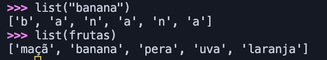
- os elementos da lista começam como 0
- manipulando listas:
    - alterando elementos:
    ```python
    frutas[1] = "laranja"
    ```
    - inserção de elementos
        - usar a função `append` - anexa na ultima posição
        ```python
        frutas.append("laranja")
        ```
        - usando a função `insert` - adiciona o elemento em uma posição
        ```python
        frutas.insert(2, caqui)
        ```
    - saber a posição de um elemento - usar a função `enumerate`
    ```python
    for i, fruta in enumerate(frutas):
    print(f"Posição: {i}, fruta: {fruta};")
    ```
    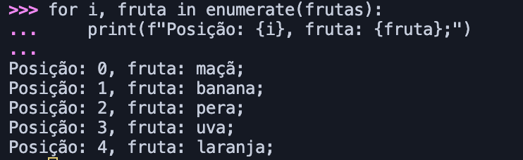
    - juntar duas listas em uma - tem duas formas:
        - criando uma nova variável com o sinal de `+` - cria uma **lista nova** com uma **nova variável**
        ```python
        frutas_raras = ["rabutã", "physalys"]
        frutas_completas = frutas + frutas_raras
        ```
        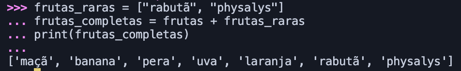
        - usando a função `extend` - **adiciona** a segunda lista na primeira
        ```python
        frutas.extend(frutas_raras)
        print(frutas)
        ```
    - remover elemento da lista
        - função `remove` - se remover algo que não exite na lista, ele retorna um erro
        ```python
        frutas.remove("laranja")
        print(frutas)
        ```
        - função `pop` vazia - remove apenas o ultimo elemento
        ```python
        frutas.pop()
        print(frutas)
        ```
        - se quiser retirar de uma posição específica, é só colocar o numero correspondente dentro da função `pop` (0 retira o primeiro elemento da lista)
            - essa função altera a posição e o índice dos elementos restantes na lista
        ```python
        frutas.pop(0)
        print(frutas)
        ```
    - saber o tamanho da lista - função `len`
        ```python
        print(f"Tamanho da lista é {len(frutas)}")
    - ver apenas um pedaço da lista - colocar o intervalo que quer saber
        - não inclui o ultimo numero colocado (no exemplo abaixo, não inclui a posição 2)
    ```python
    print(frutas[0:2])
    ```
    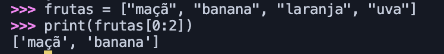
    - ordenar uma lista
        - função `sort()`
            - não precisa de uma variável associada
            - ordena alfabeticamente
        - função `sorted`
            - precisa ter uma variável associada, mesmo que ela seja a mesma que estamos usando.
        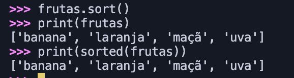
    - limpar a lista, removendo tudo - função `clear`

### Tuplas

- é uma coleção ordenada, porém imutável
    - retorna um erro caso tente mudar um elemento
- **inserir um elemento**
    - tupla existente + novo valor
- dá para fazer um `count` para saber quantas vezes um elemento aparece em uma tupla
- usando a função `index`, podemos saber quando é a primeira ocorrência - retorna o numero da posição 

### Dicionários (dict)

- coleção de palavras chave-valor
    ```python
    integrantes = {"nome" : "Luiza", "idade" : 34}
    ```
    - com a função `keys` eu consigo ver apenas as chaves;
    - com a função `values` eu consigo ver apenas os valores;
    - com a função `items` eu consigo ver todos os pares;
    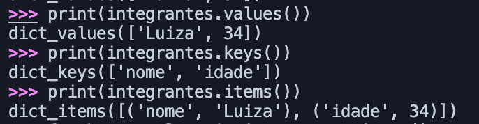
    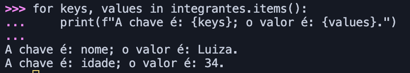
- acessar valores com base nas chaves
    - usando `get()` - se a chave existir ele retorna o valor, se **não existir** ele retorna `none`
    ```python
    print(integrantes.get("idade"))
    ```
- inserir valores em uma nova chave é só colocar a variável com a nova chave entre `[]`e depois adicionar o conteudo
    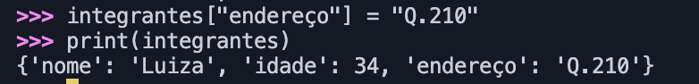
- alterar o valor de uma chave existente é parecido com o de inserir nova chave, porém voce coloca uma chave já existente e um novo valor pra ela.
- adicionar uma nova chave-valor
    - criar uma nova variável dict
    - usar a função `update`
    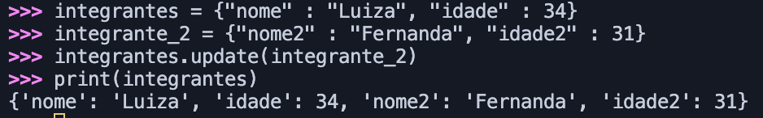
    - **PORÉM**, se as chaves tiverem o mesmo nome, os valores da primeira serão substituídos pelos valores da segunda
    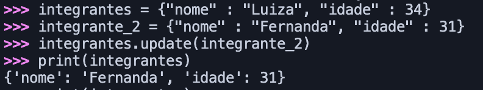
- a função `pop` também funciona aqui para retirar o par chave-valor
    - se usar `popitem` ele retira o ultimo par chave-valor
- a função `clear` também funciona aqui

### Conjuntos (sets)

- coleção não ordenada e sem elementos repetidos
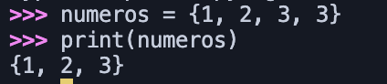
- usando a função `add` para adicionar um valor repetido, ele mesmo assim retorna a coleção sem valor repetido
    - pode usar ela para incluir um valor diferente dos já existentes
- pode usar a função `update` para adicionar um conjunto em outro
- gera um erro caso tente retirar um elemento que não existe com `remove`
    - para não dar erro, pode usar a função `discard`
    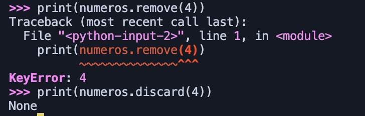
    - a função `pop` remove um valor aleatório do conjunto
- unir conjuntos com função `union` ou usando o simbolo `|`
- intersecção de conjuntos é usando a função `intersection` ou o simbolo `&`
- os elementos diferentes de cada conjunto podemos usar `difference` ou `-`
- `symetric_difference` e o simbolo `ˆ` trazem os numeros que estão presentes no primeiro conjunto mas não no segundo
- a função `issubset` (ou `<=`) informa se o conjunto da esquerda é um subconjunto do da direita
    - a função `issuperset` (ou `>=`) informa se o conjunto da direita é um subconjunto do da esquerda
    - elas retornam valores booleanos

## Funções

- reutilização de blocos de codigo
- como chamar:
    ```python
    def nome_da_função(parâmetro)
        return f"uma frase {parâmetro}"
    print(nome_da_função(X))
    ```
- parâmetros:
    - o parâmetro pode ser uma variável
    - podem ter multiplos parâmetros
- algumas funções já são internas, ou `built-in`:
    - print()
    - len()
    - type()
    - max(), min(), sum()

## Estruturas de controle

### condicionais

- if, elif, else
    - é no mesmo sentido de if - then if - else do JS
    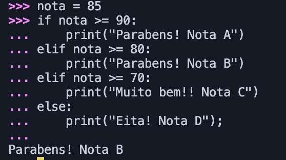

### laços de repetição

- agem sobre sequencias
- `for ... in` - também chamado `loop`
    - imprime cada elemento da sequencia/variável
- `while`
    - repete a condição até que ela não seja mais verdadeira
    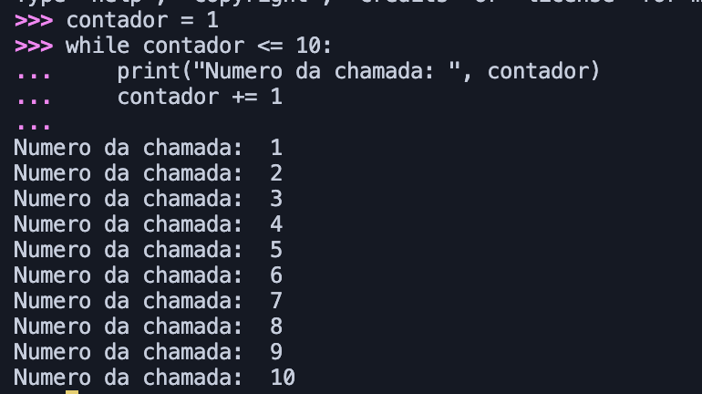
- `break`, `continue`, `pass`
    - ajudam no controle dos laços de repetição
    - podem ser usados em funções também
    - `break` faz parar ao chegar em uma determinada condição
    - `continue` e `pass` fazem continuar mesmo que ache um valor que resolve a condição
- `try` ... `except` ... `else` ... `finally`
    - voce pede pra ele tentar executar algo e já preve erros usando o `except`
    - o else é para quando satisfaz a condição
    - o finally é pra realmente finalizar tudo

## Manipulação de arquivos

- escrever arquivos
    - para adicionar nova linha, usar no inicio ou no final `\n`
    - usando a sintaxe abaixo, nós criamos o arquivo novo e escrevemos nele
    ```python
    with open("novo arquivo.txt", "w") as arquivo
        arquivo.write("olá")
        arquivo.write("Tudo bem?")
    ```
    - `w` é para sinalizar que vamos escrever, write
- ler um arquivo
    - colocamos `r` no lugar do `w`
    ```python
    with open("novo arquivo.txt", "r") as arquivo
        conteudo = arquivo.read()
        print(conteudo)
    ```
    - para ler linha por linha, colocamos um `for ... in`
    ```python
    with open("novo arquivo.txt", "r") as arquivo
        for linha in arquivo:
            print(linha.strip())
    ```
- adicionar conteudo ao arquivo, substitui o `w` por `a`, de append

