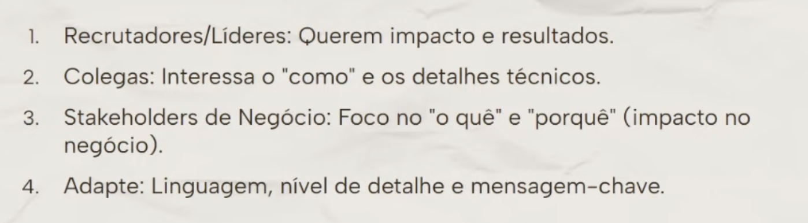

# Storytelling e insights

- é contextualizar, engajar
- pode ser na maneira que coloca um slide em ordem
- não deixar dados soltos
- entender o publico alvo faz toda a diferença

- precisa dominar o assunto, mesmo que pouca coisa dele esteja ali na apresentação
    - quanto mais proximo voce está do contexto, mais assertivo serão os dados que voce vai apresentar
- ter uma unica mensagem para passar pra as pessoas
    - que seja clara e concisa (que se resuma em uma frase)
    - que tenha um gancho (algo que prenda a atenção)
- ter perguntas direcionadas para serem respondidas durante a montagem de uma apresentação
    - sempre apresente o impacto daquele tema estudado

## na fala
- não fazer:
    - churn aumentou de 8 para 12%
    - a taxa de retenção foi 15%

- fazer: 
    - contexto e situação
    - insight
    - ação sugerida

## no slide

- o slide traz informações mais objetivas e diretas
- prestar atenção na qualidado dos slides, organizando

## Storytelling da sua vida

- apresentar como os dados, a visão crítica e visão analítica estiveram presentes nas carreiras anteriores

