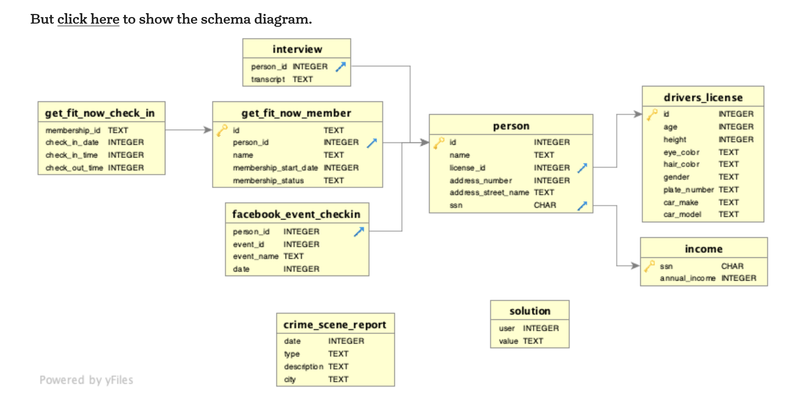
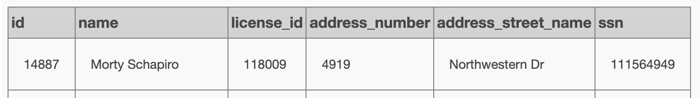
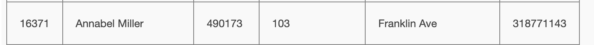
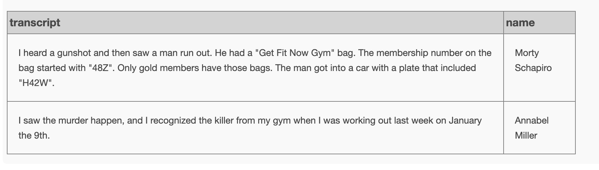
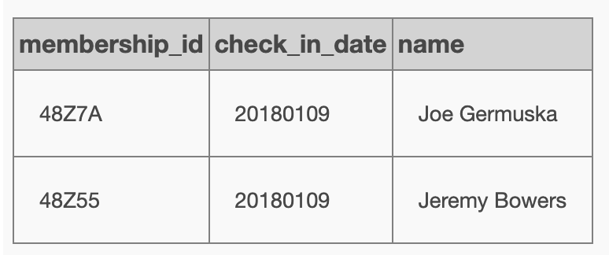
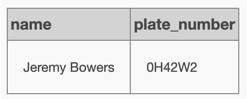
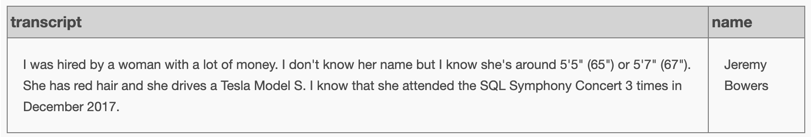

# [SQL Murder Mistery](https://mystery.knightlab.com/)

## Infos iniciais

A crime has taken place and the detective needs your help. The detective gave you the crime scene report, but you somehow lost it. You vaguely remember that the crime was a ​murder​ that occurred sometime on ​Jan.15, 2018​ and that it took place in ​SQL City​. Start by retrieving the corresponding crime scene report from the police department’s database.

## queries



```sql
SELECT *
FROM crime_scene_report
WHERE date = 20180115 AND city = "SQL City"
```


```sql
SELECT *
FROM person
WHERE address_street_name = "Northwestern Dr"
ORDER BY address_number desc
```

1st witness:


2nd witness:


transcrição do testemunho
```sql
select interview.transcript, person.name
from person
join interview ON person.id = interview.person_id
where person.name = "Morty Schapiro" OR person.name = "Annabel Miller"
```



2 suspeitos

```sql
select get_fit_now_check_in.membership_id,
	get_fit_now_check_in.check_in_date,
	get_fit_now_member.name
from get_fit_now_member
join get_fit_now_check_in ON get_fit_now_check_in.membership_id = get_fit_now_member.id
where check_in_date = 20180109 AND membership_id like "48Z%"
```



O assassino:

```sql
select get_fit_now_member.name,
	drivers_license.plate_number
from get_fit_now_member
join person on get_fit_now_member.person_id = person.id
join drivers_license on person.license_id = drivers_license.id
where plate_number like "%H42W%"
```



testemunho do assassino:

```sql
select interview.transcript, person.name
from person
join interview ON person.id = interview.person_id
where person.name = "Jeremy Bowers" 
```



Quem encomendou o crime:

```sql
select person.name, interview.transcript,
drivers_license.hair_color, drivers_license.height, drivers_license.gender, income.annual_income
from person
join interview on person.id = interview.person_id
join drivers_license on person.license_id = drivers_license.id
join income on person.ssn = income.ssn
where drivers_license.hair_color = "red" AND drivers_license.gender = "female" AND drivers_license.height between 65 and 67
order by annual_income desc
```

tentei vários nomes dessa lista e cruzando com os eventos do facebook e com o income e nenhuma deu certo.
