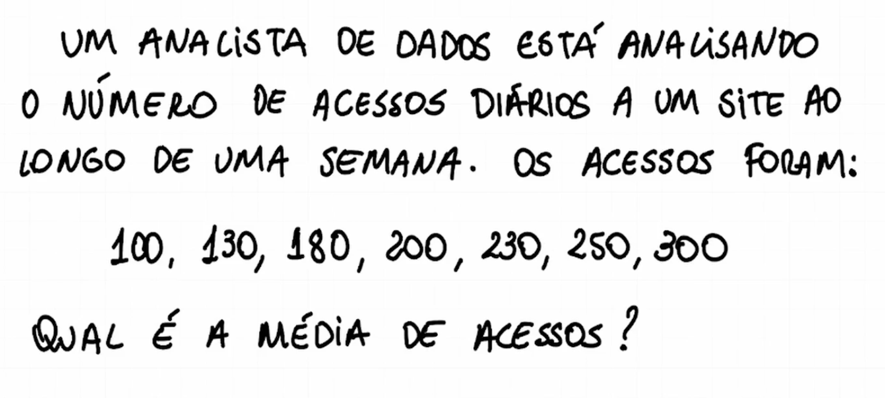
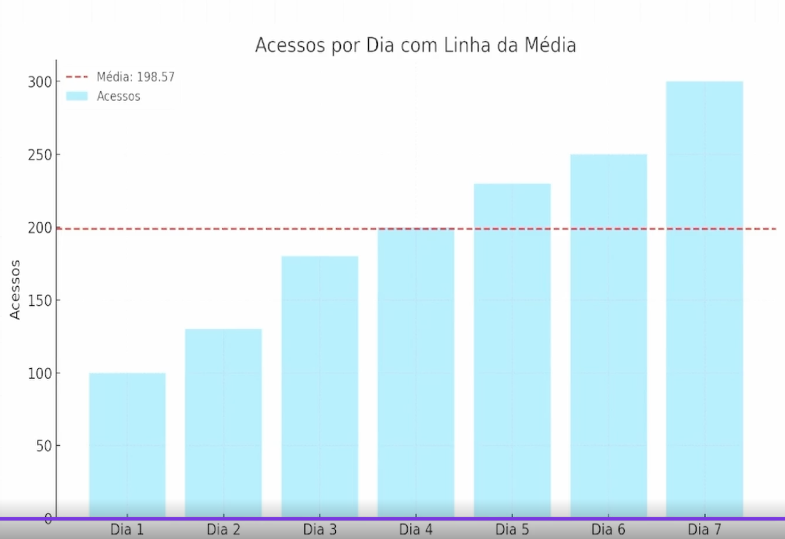
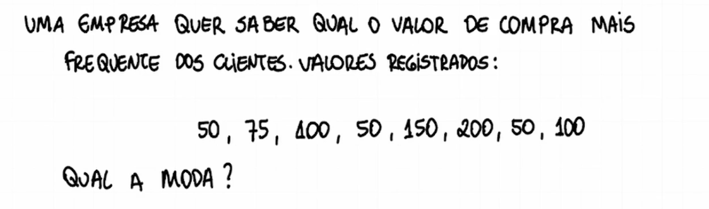
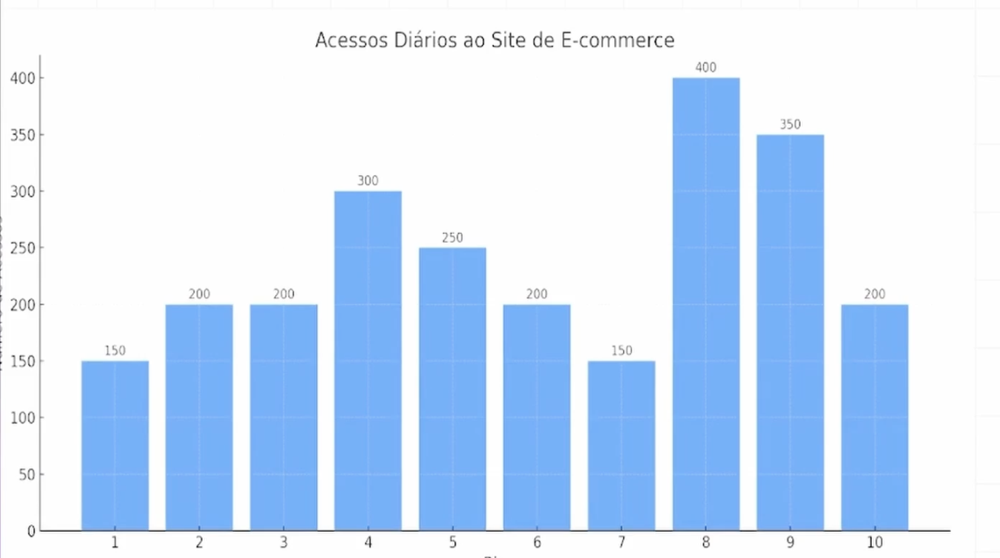

# Estatística descritiva

## medidas de tendencia central

- valor central ou mais frequente
- resumem o conjunto de dados

- **média**
  - soma de tudo dividido pela quantidade de numeros
  - 1, 2, 3, 4, 5
  --> média = 15/5 = 3
  
  - 100 + 130 + 180 + 200 + 230 + 250 + 300 = 1390
  - são 7 numeros --> 1350/7 = 198,57
  - em gráfico:
    
- **moda**
  - valor que mais se repete, o mais famoso, o mais comum
  - 1, 2, 3, 3, 3, 5, 6 --> moda = 3
  
  - o valor que mais se repete é 50
- **mediana**
  - é o valor central de um conjunto ordenado de forma crescente ou decrescente
  - 1, 3, 4, 6, 5, 8, 2 --> 1, 2, 3, 4, 5, 6, 8 --> mediana = 4

- **exercício**
  
  - média = 2400/10 = 240
  - moda = 200
  - mediana = 400/2 = 200
  - qual dia teve maior numero de acessos? no dia 8
  - existe algum dia com numero de acessos abaixo da média? sim, 6 dias ficara abaixo da média
  - comente rapidamente sobre o comportamento dos dados: são uniformes? concentrados? ou apresentam picos e vales? não são uniformes, possuindo vales e picos, com um pico maior no dia 8 e os vales mais baixos nos dias 1 e 7