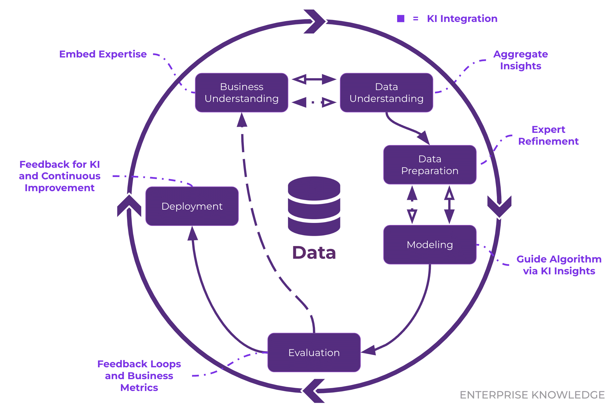
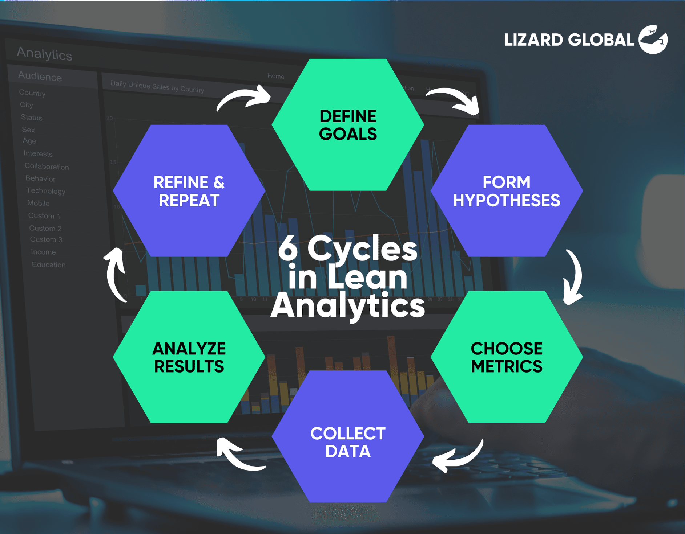
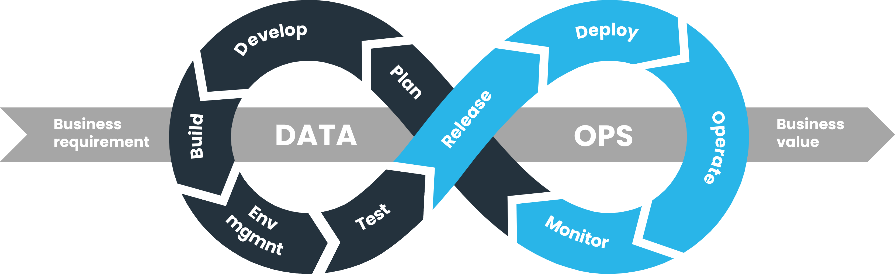

# Metodologias para analisar os dados

## CRISP-DM

- utilizada em análises pontuais, um processo para responder uma pergunta
- é a mais comum
- compreensão de negocio > conversa com stakeholders > compreenção dos dados (quais voce precisa) > modelagem dos dados > avaliação e validação dos dados > implantação do modelo (deploy)

## Lean analytics

- enxuta, diminuir o tempo do processo de análise
- aprender > ter a ideia: metricas e KPIs > testar

## DataOPS

- vem do devops
- se preocupa mais com governança de dados
- mais comum de cientistas e engenheiros de dados
- planejamento > código > build > testes > release > deploy > operação > monitoramento

## A/B testing

- parece o lean analytics
- vem do UX
- metodo de experimentação
- problema > hipoteses 1, 2, 3 > qual o melhor resultado
