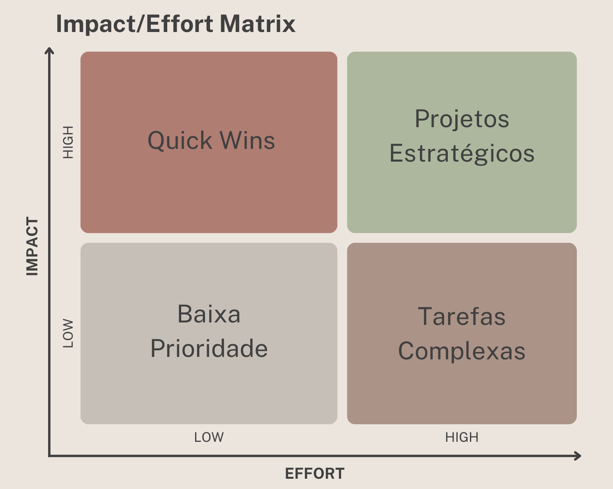

# Priorização de demandas

## Calssificações

- Quick wins
- projetos estratégicos
- tarefas complexas
- baixa prioridade

## Priorização

- Must-have - necessario
- should-have - importante
- could-have - desejável
- won't-have - descartável por ora

