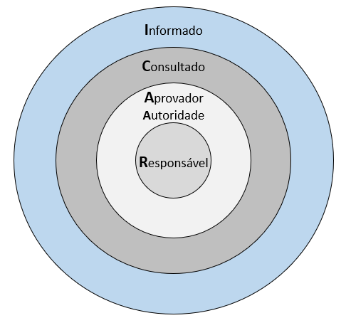

# Stakeholders

- pessoa envolvida na análise
- quem é o tomador de decisão?
- quem será mais afetado?

## Matriz R.A.C.I.

- como usar:
  - mapear todas as atividades ou entregáveis do projeto
  - definir quem é quem no projeto
  - evitar muitos accountables para a mesma tarefa
  - use tabela para visualizar

