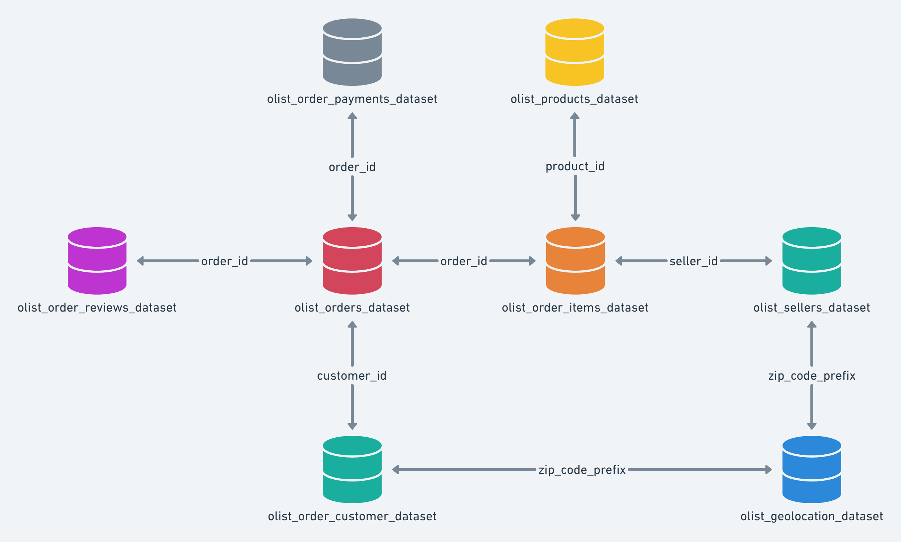

# Curso de SQL do Theo Calvo

## Material

O Teo organizou o curso em vídeos e em um [repositório do github](https://github.com/TeoCalvo/teoSQL-V2/tree/main).

Nesse repo a gente acha:
- explicações extras
- material de cada aula
- resolução de exercícios

O banco de dados que usamos é o `olist.db` que possui a seguinte estrutura:

## Onde acessar

Aula 1 - [SELECT FROM WHERE](https://www.youtube.com/watch?v=PXftBr56Tow)

Aula 2 - [GROUP BY](https://www.youtube.com/watch?v=BPwGCEsPxMI)

Aula 3 - [CASE WHEN, COALESCE, LIKE, IN](https://www.youtube.com/watch?v=7Ikyb5-5gOQ)

Aula 4 - [Como fazer JOINs com SQL!!](https://www.youtube.com/watch?v=jJxC0i6OtQQ)

Aula 5 - [Como funciona as SUBQUERIES? O que é WITH?](https://www.youtube.com/watch?v=1ulTb3u8aPk)

Aula 6 - [O que são WINDOW FUNCTIONS??](https://www.youtube.com/watch?v=v3U5ViG-rkc)

Aula 7 - [Como fazer CREATE TABLE no SQL](https://www.youtube.com/watch?v=K2V0ZJA3yK0)

## Como eu me organizei

- As informações necessárias para todas as aulas estão na pasta [theo-sql-course](https://github.com/luhm/learning-code/blob/main/today-I-learnt/teo-sql-course).
- As **anotações** sobre cada aula e conteúdo estão listadas abaixo, de acordo com a semana que eu fiz a aula.

- aula 1 - [Harold-week](https://github.com/luhm/learning-code/blob/main/today-I-learnt/harold-week/theo-sql)

